# SkillHub 安全管理项目 — AGENTS.md

> 本文件是项目统一上下文与执行约束。后续人工或 AI Agent 继续设计、开发或维护本项目时，应优先遵循本文。
>
> 当前策略版本：v1.0
>
> 基线日期：2026-08-27
>
> 最终统一框架：`docs/11-final-skill-security-management-framework.md`
>
> 当前建设规划：`docs/12-skill-security-implementation-plan.md`
>
> 当前批量审查设计：`docs/13-skill-batch-security-review-and-scoring-design.md`

## 1. 当前项目范围

第一阶段只治理 **已经进入公司 Gerrit 代码仓库的 Skill**。

当前纳管对象：

- Gerrit 仓库内存在 `SKILL.md` 的 Skill；
- `SKILL.md` 所在目录及其受管控子文件；
- Skill 在 Gerrit 中的来源、版本、扫描、审核、SkillHub 纳管状态。

第一阶段暂不解决：

- 员工本地临时 Skill；
- 公网 SkillHub / GitHub 直接安装；
- 外部 Skill 引入审批；
- Agent Runtime 强制可信源；
- 终端侧旁路检测。

这些能力可作为后续阶段扩展，但 `Out of Scope` 不代表 `Trusted`。

## 2. 已确认的核心设计决策

### 2.1 Skill 边界

- `SKILL.md` 是 Skill 的**识别锚点**；
- `SKILL.md` 所在目录定义为 `Skill Root`；
- Skill Root 下纳入策略的全部文件共同构成 `Skill Package`；
- 安全扫描与内容摘要针对整个 Skill Package，而不是只针对 `SKILL.md`。

因此：

> `SKILL.md` 用于识别边界，但 Skill Root 内任意受管控文件变化都必须进入 Skill 变更识别流程。

### 2.2 Gerrit 服务端统一触发

Skill 检查在 Git/Gerrit 服务端统一触发，不依赖开发者本地 Hook。

服务端流程应覆盖：

- Add；
- Modify；
- Delete；
- Rename；
- Copy；
- `SKILL.md` 未变化但 scripts/references/config 等文件变化。

系统上线前必须执行一次 Baseline 全量盘点；上线后使用服务端 Hook/Event 做增量发现，并增加定时 reconciliation 补偿漏事件。

### 2.3 Skill Source 的初始识别规则

第一阶段使用：

```text
repository + branch + skill_path + skill_name
```

识别一个 `Skill Source`。

任一字段不一致时，先作为独立 Source 记录，不在发现阶段强行判定为同一个 Skill。

后续通过人工确认、内容相似度、来源关系等方式，将多个 Source 关联到同一个 `Canonical Skill`。

**禁止通过物理删除或覆盖历史记录完成“合并”**。多个引用来源必须长期保留。

### 2.4 版本分为两类

项目必须同时保存：

1. **Source Revision**：Git 来源版本，以 commit/revision SHA 为核心；
2. **Content Version**：Skill 内容版本，以整个 Skill Package 的 SHA-256 `skill_digest` 为核心。

核心原则：

> **Commit/Revision 是来源版本，Digest 是内容版本；安全扫描和审核绑定内容版本，Git 追溯绑定来源版本。**

不使用 MD5 作为安全完整性标识，统一使用 SHA-256。

### 2.5 同内容允许复用安全结论

不同 commit、不同 Source 可能得到相同 `skill_digest`。

例如：

```text
Source A / commit 1 -> Digest X
Source A / commit 2 -> Digest Y
Source A / commit 3 -> Digest Y
Source B / commit 8 -> Digest Y
```

Git 角度有多个 Revision；内容角度只有 X、Y 两个 Content Version。

扫描任务、审核结果应优先绑定：

```text
skill_digest + scanner_version + policy_version
```

相同内容可以复用已有扫描/审核结论，但必须保留各自 Source Revision 的追溯关系。

### 2.6 自动扫描与 CM 审核

CM 的主要职责是 Skill 安全治理流程执行，而不是独立承担所有代码安全判断。

推荐职责：

- 自动扫描器：发现 Prompt、脚本、依赖、敏感信息、危险调用等风险；
- CM：确认扫描完成、处理待办、查看扫描结果、执行审核流程、维护状态；
- 高风险/扫描无法判断/策略例外：按公司机制升级 Security 或相关专家复核。

扫描可由以下入口触发：

- Gerrit 服务端发现后自动触发；
- 定时批量扫描；
- iflytek SkillHub 内置 Scanner；
- 后续新增的公司 Scanner Adapter。

公司治理结论不得只依赖某一个具体扫描器的 `Passed` 字段。

### 2.7 SkillHub 纳管时机

公司内部 SkillHub 在讯飞开源 SkillHub 与公司 AI WorkForce 平台 Skill 商城之间评估选择，最终以功能、安全、维护和内部使用要求为准。

统一流程：

```text
Gerrit 发现
 -> 资产数据库登记
 -> Source Revision
 -> Content Digest
 -> 自动扫描
 -> CM/策略审核
 -> 平台建立私密候选并提醒产品线
 -> 产品线确认是否上架
 -> 产品线自行上传或提交上架申请
 -> 核对上传版本与审核版本
 -> Published
```

平台可以根据台账建立私密候选或发送提醒，但候选 Skill 不得被普通用户搜索和安装。CM、平台和 SkillHub 管理员不得代替产品线自动公开上架。

### 2.8 存量 Skill 批量审查

当前存量审查输入为 CSV，兼容以下字段：

```text
skill_name
repo_name
branch
skill_path
lasted_commited
security_reviewed
status
```

已确认规则：

- `lasted_commited` 只作为现有台账字段兼容，内部保存为 `inventory_revision`，不能直接当作最终审查版本；
- 审查前必须从 Gerrit 冻结实际来源版本，并与 CSV、分支和 Skill 路径对账；
- Source 事实身份仍包含 branch，不删除多分支来源；批量审查选择视图按 `repo_name + normalized_skill_path` 比较各分支中该路径最近变化时间，只审常规最新候选；
- 同时间但内容不同的分支版本不能静默任选，应分别检查并进入人工确认；
- 同一仓库一次下载，但不同 Skill 可以绑定不同冻结 Revision；
- Cisco AI Skill Scanner 与 NVIDIA SkillSpector 先对同一内容版本并行完成静态检查；
- AI 审查使用 `skills/skill-security-review/`，由 Claude Code 调用公司内网模型执行；AI Skill 只读、不联网、不执行被审查内容；
- 安全结论与质量得分分别保存。安全未通过或检查不完整时，质量高分不能放行；私密候选质量门槛当前为 70 分；
- 通过内容只生成本地私密候选工作空间，不自动 Commit、Push 或上架；由负责人后续手动同步到私密 Git 中转仓库；
- 原始报告进入受限证据区，不进入私密候选 Git 工作空间。

## 3. 核心对象模型

```text
Canonical Skill
    │
    ├── Skill Source A
    │      ├── Source Revision A1 ──> Content Version X
    │      ├── Source Revision A2 ──> Content Version Y
    │      └── Source Revision A3 ──> Content Version Y
    │
    └── Skill Source B
           └── Source Revision B1 ──> Content Version Y

Content Version Y
    ├── Scan Result 1
    ├── Scan Result 2
    └── Review Record
```

六个核心概念：

- **Canonical Skill**：逻辑上的同一个 Skill 能力；
- **Skill Source**：一个具体 Gerrit 仓库/路径/名称来源；
- **Source Revision**：一个 Source 在某次 Git commit/revision 的快照；
- **Content Version**：由 SHA-256 digest 标识的 Skill Package 内容版本；
- **Scan Result**：针对内容版本的自动扫描记录；
- **Review Record**：针对内容版本的治理审核结论。

## 4. Gerrit 发现推荐流程

```mermaid
flowchart LR
  A[Gerrit 服务端 Hook/Event] --> B[Changed Files]
  B --> C[Skill Root Resolver]
  C --> D{是否命中 Skill}
  D -->|新 Source| E[创建 Skill Source]
  D -->|已有 Source| F[定位已有 Source]
  E --> G[创建 Source Revision]
  F --> G
  G --> H[完整 Skill Package Snapshot]
  H --> I[计算 SHA-256 Digest]
  I --> J{Digest 是否已有}
  J -->|是| K[关联已有 Content Version]
  J -->|否| L[创建 Content Version]
  L --> M[自动扫描]
  K --> N[复用/重新评估已有安全结论]
  M --> O[CM/Policy Review]
  N --> O
  O --> P{Approved?}
  P -->|是| Q[提醒产品线自行上传/申请上架]
  P -->|否| R[待整改/驳回]
```



## 5. Skill Source 识别与合并原则

### 新 Source 判定

以下任一变化先按新 Source 登记：

- repository 不同；
- branch 不同；
- skill_path 不同；
- skill_name 不同。

### 后续 Canonical 合并

多个 Source 可以关联到同一个 Canonical Skill，但应满足：

- 不删除原 Source；
- 不改写历史 Revision；
- 保存 `canonical_skill_id` 关联；
- 保存谁在何时执行了关联/拆分；
- 支持后续发现误合并时重新拆分。

建议不要仅凭名称自动合并。

## 6. Digest 规范

Digest 必须覆盖整个受管控 Skill Package。

推荐算法：

1. 遍历 Skill Root 内纳管文件；
2. 相对路径规范化并排序；
3. 对每个文件计算 SHA-256；
4. 组合 `relative_path + file_hash + file_mode` 生成规范清单；
5. 对规范清单再次计算 SHA-256，得到 `skill_digest`。

必须定义并测试：

- 换行符规范；
- Unicode 路径；
- executable bit；
- symlink；
- Git LFS；
- 二进制；
- 文件忽略规则。

## 7. 状态建议

不要只保存“是否经过安全审查：是/否”。

### Scan Status

```text
NOT_SCANNED
PENDING
RUNNING
PASSED
FAILED
ERROR
```

### Review Status

```text
NOT_REVIEWED
PENDING
APPROVED
REJECTED
EXCEPTION
STALE
```

### SkillHub Status

```text
NOT_SYNCED
DRAFT
PUBLISHED
OFFLINE
REVOKED
```

UI 可以继续显示简化的“是否安全审查”，但底层必须保留完整状态。

## 8. 第一阶段安全审查范围

至少检查：

- `SKILL.md` 格式与指令风险；
- Skill 描述与实际行为是否一致；
- Shell/Python/JS/PowerShell 等脚本；
- 文件读写；
- 网络访问；
- 凭据/环境变量访问；
- MCP/工具调用；
- 外部 URL；
- 依赖与安装脚本；
- 动态下载/执行；
- 混淆代码；
- 敏感信息；
- Prompt Injection / Tool Poisoning。

第一阶段可以先由自动 Scanner 产出风险结论，CM 基于结果执行审核；风险分级与自动放行规则后续逐步细化。

## 9. 高概率实现问题

1. 历史 Skill 必须 Baseline，否则增量上线后台账天然不完整。
2. Rename/Delete 必须同时处理 old path 与 new path。
3. 一个 commit 可能修改多个 Skill，必须逐 Skill 生成 Revision。
4. 同一 Skill 连续 patchset 会产生乱序任务，需要幂等与当前版本指针。
5. 相同 digest 不应重复创建 Content Version。
6. Scanner 结果复用时仍需考虑 scanner/policy version 是否变化。
7. Skill 审核过程中发生新提交，旧 Revision 的审核结果可以保留，但不能错误标记最新 Revision 已通过。
8. 定时批量扫描与事件扫描可能重复，任务 key 必须幂等。
9. SkillHub 同步失败不能丢失已完成的审核结论，应单独记录同步状态并重试。
10. `repo + branch + path + name` 是 Source 标识，不是全局 Canonical Skill 标识。

## 10. 当前建设规划

建设顺序、交付成果和完成标准统一维护在 `docs/12-skill-security-implementation-plan.md`，本文件不再重复维护计划内容。

## 11. 开发约束

1. 所有事件处理必须幂等。
2. Source Revision 不可覆盖历史记录。
3. Content Version 以 SHA-256 digest 去重，不使用 MD5。
4. Canonical 合并只做逻辑关联，不物理删除 Source。
5. 扫描结果必须记录 scanner name/version 与 policy version。
6. 自动扫描器不直接拥有最终发布权限。
7. SkillHub 同步状态与安全审核状态分离。
8. 扫描阶段默认不执行不可信 Skill 脚本。
9. 所有关键状态变更必须产生审计记录。
10. 首版不要为了处理未纳管外部 Skill 而扩大范围，优先把 Gerrit 内部闭环做完整。

## 12. 文档索引

- `docs/01-open-source-skillhub-evaluation.md`：开源平台调研历史
- `docs/02-skill-security-management-strategy.md`：公司级策略 v0.2
- `docs/03-gerrit-skill-discovery-and-review-design.md`：Gerrit 发现/版本/扫描技术方案
- `docs/04-requirements.md`：需求拆分
- `docs/05-task-breakdown.md`：实施任务/WBS
- `docs/06-data-model.md`：Canonical / Source / Revision / Content Version 数据模型
- `docs/07-rollout-plan.md`：分阶段上线计划
- `docs/08-current-flow-reproduction.md`：当前流程与升级版流程对照
- `docs/09-complete-user-guide.md`：部署、验证与日常操作说明
- `docs/10-skill-security-governance-strategy.md`：企业级管理策略文件
- `docs/11-final-skill-security-management-framework.md`：当前正式 Skill 安全管理方案
- `docs/12-skill-security-implementation-plan.md`：当前 Skill 安全管理建设规划
- `docs/13-skill-batch-security-review-and-scoring-design.md`：存量 Skill 批量安全审查、质量评分与私密候选归档设计
- `skills/skill-security-review/`：供 Claude Code 使用的只读 AI 安全与质量审查 Skill
