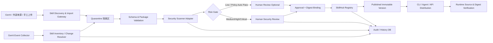

# SkillHub 安全管理项目 — AGENTS.md

> 本文件是项目的统一上下文与执行约束。无论由人工还是 AI Agent 继续设计、开发或维护本项目，都应先阅读本文件。
>
> 调研基线日期：2026-08-25。

## 1. 项目背景

公司内部正在快速产生和引用 Agent Skills。Skill 通常以一个目录存在，至少包含 `SKILL.md`，并可能包含脚本、参考资料、模板、配置等资源。Skill 会被 Agent 加载到上下文中，部分 Skill 还会进一步调用 Shell、Python、MCP、网络、凭据或其他工具，因此它本质上属于一种新的“可执行/半可执行 AI 软件供应链资产”。

当前项目聚焦两个方向：

1. **统一 SkillHub**：建设公司内网统一 Skill 注册、审查、上架、版本管理、检索和分发平台。公司内部输出或引用的 Skill 应来自公司统一 SkillHub，或至少已在 SkillHub 中完成登记和安全审查。
2. **Gerrit 全量发现与持续审查**：对公司 Gerrit 中现有和新增 Skill 自动识别、记录、跟踪变更，并生成安全审查待办，由 CM/安全人员完成审查。

当前已有方案草图：Git 提交后识别变更文件；判断是否位于已登记 Skill；若已登记则记录旧信息至历史表、更新最新 commitid 并把“已安全审查”置为否；若是新 Skill，则确认信息后登记到当前表并置为未审查。

## 2. 核心结论

### 2.1 不建议第一阶段完全自研 SkillHub

优先采用“**开源平台 + 公司适配层 + 公司安全策略引擎**”的路线。

建议双轨 POC：

- **首选候选：iflytek/skillhub**
  - 面向企业私有 Skill Registry，Apache-2.0。
  - 已包含 Web、REST API、CLI、版本、命名空间、RBAC、审计、安全扫描、Docker/Kubernetes 等企业能力。
  - 适合直接验证“注册 → 审核 → 发布 → 分发”的完整流程。
  - 当前仍是 0.x 版本，生产采用前必须补充稳定性、升级兼容、SSO、数据库、HA、灾备、安全测试评估。

- **第二候选：Nacos 3.2+ Skill Registry**
  - Nacos 从 3.2.0 起提供 Skill Registry；具备创建、版本、草稿/审核/上线/下线、安全 Pipeline、CLI/API/SDK、命名空间等能力。
  - 最大优势是可把 Skill、Prompt、MCP、Agent 等 AI 资产放在统一控制面治理。
  - 如果公司已有 Nacos 运维体系、Java 技术栈或计划统一建设 AI Registry，优先级会明显上升。
  - 需要重点验证 Skill 安全审查的可扩展性、公司 SSO/RBAC 模型、Gerrit 接入方式和审计能力是否满足公司要求。

### 2.2 其他可参考开源方案

| 项目 | 定位 | 适用建议 |
| --- | --- | --- |
| `saker-ai/skillhub` | Go 单体、自托管、Git 原生版本、RBAC、Webhook 导入 | 适合轻量 POC/参考实现；生产前需重点看社区活跃度与企业功能成熟度 |
| `airopshq/skillshub` | GitHub 仓库作为 Skill 单一事实源，CLI/MCP 同步到 Agent | 很适合参考“Git-native 分发/同步”，但不是完整安全治理控制面 |
| `ComeOnOliver/skillshub` / `agent-skills-hub` | 公共技能目录/搜索/聚合 | 适合参考搜索、分类、安装体验，不建议作为公司内网安全治理底座 |
| `thesash/skill-hub` 等 | 本地多 Agent Skill 同步工具 | 可参考客户端同步机制，不承担企业审核与合规治理 |

### 2.3 安全扫描引擎建议采用可插拔方式

优先调研并做适配：

- `cisco-ai-defense/skill-scanner`
  - 支持规则/YARA、行为数据流、LLM 分析、SARIF、API、pre-commit/CI；官方也明确“扫描通过不等于绝对安全”。
- `NVIDIA/SkillSpector`
  - 支持静态 + 可选 LLM 语义分析、危险代码、数据泄露、Prompt Injection、供应链、MCP 权限等多类风险，可输出 JSON/Markdown/SARIF。

项目不得绑定单一扫描器。设计统一 `Scanner Adapter`：输入 Skill 包/目录 + policy version，输出标准化 finding、severity、risk score、scanner/version、evidence。

## 3. Skill 安全治理原则

1. **统一入口**：生产使用的 Skill 必须来自公司 SkillHub 或公司批准的受控镜像。
2. **默认不信任**：外部下载、个人仓库、历史遗留 Skill 默认视为未审查。
3. **审批绑定内容**：安全审批绑定 `skill_digest`（Skill 整个目录的规范化内容摘要），commit id 仅用于来源追溯。
4. **任何内容变化都会失效旧结论**：`SKILL.md`、scripts、references、assets、manifest 等纳入 Skill 包的文件发生变化时至少重新自动扫描；是否需要重新人工审查由风险策略决定。
5. **职责分离**：开发者/作者不能单独完成高风险 Skill 的最终安全放行。
6. **自动扫描 + 人工复核**：自动工具是第一层，不能代替人工判断。
7. **最小权限**：Skill 声明/使用的 Shell、网络、文件、MCP、密钥、系统操作权限必须最小化。
8. **不可变发布**：已发布版本不可原地修改；修改必须生成新版本/新 digest。
9. **可追溯**：任何发布版本必须能追到仓库、branch、Change-Id、patchset/revision、作者、扫描记录、审查人、策略版本、发布时间。
10. **可撤销**：发现风险后能够立即下架/吊销，不允许客户端继续默认安装被撤销 digest。

## 4. 推荐总体架构



控制面应分为：

- **发现层**：从 Gerrit/外部源发现 Skill。
- **隔离层**：未审查 Skill 不直接进入生产目录。
- **扫描层**：格式、静态、依赖、Prompt、脚本、数据流、供应链扫描。
- **人工审查层**：处理高风险、扫描异常、策略例外。
- **Registry 层**：版本、状态、权限、审计、分发。
- **运行时门禁**：客户端仅信任内网 Registry + Approved digest。

## 5. 对当前 Gerrit 方案的优化

### 5.1 不要只判断“新增文件是否包含 SKILL.md”

必须识别 **Skill 目录级别的变更**。

正确算法建议：

1. 获取 patchset/commit 的 changed files，包含 add/modify/delete/rename/copy。
2. 对每个新路径和旧路径分别向上查找最近的 `SKILL.md`，确定其所属 Skill Root。
3. 对直接新增/删除/rename 的 `SKILL.md` 单独处理。
4. 对每个受影响 Skill Root 计算整个 Skill 包的新 digest。
5. 如果 digest 变化，则触发新扫描；旧审批不能直接复用。
6. 一个提交可能同时修改多个 Skill，必须生成多条独立记录。

这样可以覆盖：

- `SKILL.md` 没改，但 `scripts/a.py` 被植入恶意代码；
- Skill 文件夹 rename/move；
- 删除 `SKILL.md`；
- 已登记 Skill 新增脚本/依赖；
- 单 commit 同时修改多个 Skill。

### 5.2 不依赖开发者本地 Git Hook

客户端 Hook 可被绕过、未安装、被覆盖。

优先：

- Gerrit 服务端 `patchset-created` / `ref-updated` 事件；
- Gerrit Event Stream / Plugin；
- 与 Gerrit Code Review Label / CI Check 结合做 Submit Gate。

推荐模式：

- **异步发现**：事件进入队列，避免 SkillHub/扫描器故障拖垮 Gerrit。
- **同步门禁**：在需要进入受保护分支、发布 Skill 或上架 SkillHub 时检查审核状态；关键流程可 Fail Closed。

### 5.3 `是否经过安全审查` 不应只有布尔值

推荐状态：

```text
DISCOVERED
  -> SCAN_PENDING
  -> SCANNING
  -> SCAN_FAILED / REVIEW_REQUIRED
  -> APPROVED / REJECTED
  -> PUBLISHED
  -> STALE (内容发生变化)
  -> REVOKED / OFFLINE
```

同时保存：

- `risk_level`
- `risk_score`
- `scanner_name`
- `scanner_version`
- `policy_version`
- `reviewer`
- `reviewed_at`
- `approved_digest`
- `review_expire_at`（如果公司策略要求定期复审）
- `exception_id`（如有风险接受）

### 5.4 commitid 继续保留，但不要作为安全结论主键

至少记录：

- repository
- branch
- skill_path
- skill_name
- Gerrit Change-Id
- patchset number
- revision SHA
- merged commit SHA（合入后）
- `skill_digest`
- source type

安全批准真正绑定 `skill_digest + policy_version`。

### 5.5 当前两张表需要升级

现有 `skill_summary` + `skill_history` 思路是对的，但建议：

- `skill_summary` 只表示“当前视图”；
- `skill_version` 保存每个内容版本；
- `scan_result` 独立保存扫描器结果；
- `review_record` 独立保存人工审批；
- `audit_event` 保存所有状态变更；
- `source_binding` 保存 Gerrit/外部仓库来源。

不要每次简单“复制 summary 到 history”，否则以后很难表达一次版本有多次扫描、复核、撤销、重新批准。

## 6. Gerrit 实现时高概率遇到的问题

1. **历史 Skill 漏登记**：事件只能看到上线后的变化，需要先做一次全仓库 baseline scan。
2. **rename/delete**：只看新路径会漏掉旧 Skill，必须分析 old path + new path。
3. **嵌套 SKILL.md**：需定义“最近祖先 SKILL.md”还是禁止嵌套；建议同一 Skill 包中禁止再嵌套另一个 Skill，避免边界不清。
4. **分支语义**：同一路径在 feature/main/release 分支可能不同；必须规定哪个分支是正式来源，库存键需要包含 branch 或 release channel。
5. **并发 patchset**：同一 Skill 连续提交会出现扫描任务乱序；任务必须幂等并以 revision/digest 去重。
6. **扫描耗时**：不能在 Gerrit 提交主线程内直接跑 LLM/深度扫描。
7. **扫描服务不可用**：需要队列、重试、死信、告警；关键发布动作再做 fail-closed。
8. **大仓性能**：禁止每个提交全仓 grep `SKILL.md`，应使用 diff → affected skill root 的增量算法。
9. **Git LFS / submodule / symlink**：可能绕过内容扫描，第一阶段建议 Skill 包禁止 submodule、外链 symlink；LFS 需要拉取真实内容后再计算 digest 和扫描。
10. **压缩包/二进制/混淆脚本**：需要文件类型白名单、magic number、大小/文件数限制和解压炸弹防护。
11. **只扫 SKILL.md 不够**：scripts、依赖文件、配置、隐藏文件都要纳入。
12. **审批被绕过**：SkillHub 上架 API、管理员直接发布、CLI 发布等所有入口必须统一走同一 policy gate。
13. **外部 Skill 更新**：不得跟随 `main/latest` 自动升级，必须固定 commit/tag/digest，更新即重新审查。
14. **同名 Skill 冲突**：建议统一 ID：`namespace/repository/path` 或平台生成 UUID，展示名可以重复但 canonical key 不能冲突。
15. **运行时旁路**：即使有 SkillHub，用户仍可能把外部 Skill 直接复制到本地 Agent 目录。真正的策略还需客户端配置、终端管控或 Agent 启动检查来限制来源。

## 7. 推荐安全审查内容

### 7.1 基础格式

- 必须存在 `SKILL.md`；
- 校验 Agent Skills frontmatter；
- name/description 与目录、平台登记信息一致；
- 文件类型、文件数、单文件大小、总包大小限制；
- 禁止路径穿越、危险 symlink、隐藏可执行 payload。

### 7.2 Prompt / Instruction 风险

检查：

- 诱导忽略系统/开发者规则；
- 获取或输出 secrets、token、SSH key、cookie、环境变量；
- 未声明地上传源码、日志、数据；
- 诱导执行远端脚本；
- 持久化修改 Agent 配置/记忆；
- 工具投毒/MCP tool poisoning；
- 越权访问、扩大权限、关闭安全控制。

### 7.3 代码与供应链

- Shell/Python/JS/PowerShell 等脚本静态分析；
- `curl | sh`、动态下载执行、`eval/exec`、反弹连接、凭据读取等危险模式；
- 依赖是否固定版本；
- 依赖漏洞与来源；
- package hallucination / typo-squatting；
- 远端 URL 白名单与网络目的地风险；
- SBOM/依赖清单（高风险 Skill 建议要求）。

### 7.4 权限与能力一致性

对比：

- Skill 宣称的目的；
- 实际脚本行为；
- 请求的工具/MCP；
- 文件系统范围；
- 网络访问；
- 凭据访问。

出现“描述-行为不一致”必须进入人工复核。

## 8. Skill 风险分级建议

| 等级 | 示例 | 发布策略 |
| --- | --- | --- |
| L0 低风险 | 纯 Markdown、无工具、无脚本、无网络 | 自动扫描通过后可快速审批 |
| L1 中风险 | 读取项目文件、调用只读 MCP、模板生成 | 自动扫描 + 抽检/人工审批 |
| L2 高风险 | Shell、Python、写文件、网络、CI/CD、Git、数据库 | 必须人工安全审查 |
| L3 特权 | 凭据、生产环境、部署、删除、权限管理、跨系统写操作 | 双人审批/安全负责人批准 + 最小权限 + 强审计 |

## 9. 《SKILL安全管理策略》文档建议结构

正式策略文件见 `docs/02-skill-security-management-strategy.md`，应覆盖：

1. 目的与适用范围
2. 术语与资产定义
3. 威胁模型
4. 管理原则
5. 角色与职责/RACI
6. Skill 分类与风险分级
7. 来源与准入要求
8. 注册与版本管理
9. 自动扫描要求
10. 人工安全审查要求
11. 发布/上架/下架
12. 变更与重新审查触发条件
13. 外部 Skill 引入
14. 运行时分发与来源控制
15. 例外与风险接受
16. 应急下架与漏洞响应
17. 审计、日志与证据留存
18. KPI/SLA
19. 附录：检查表、状态机、字段定义

## 10. 需求分解

详细需求见 `docs/04-requirements.md`。一级需求：

- R1：Skill 统一资产模型
- R2：SkillHub 平台选型与 POC
- R3：Gerrit Skill 自动发现
- R4：基线全量盘点
- R5：自动安全扫描
- R6：人工审查工作流
- R7：版本与 digest 管理
- R8：上架/下架/撤销
- R9：内网分发与客户端来源限制
- R10：外部 Skill 隔离导入
- R11：RBAC/SSO/职责分离
- R12：审计与报表
- R13：异常/重试/高可用
- R14：安全策略与例外管理

## 11. 任务拆分

详细任务见 `docs/05-task-breakdown.md`。推荐里程碑：

### M0 — 规范与盘点

- 定义 Skill 识别规则和数据模型；
- 全 Gerrit baseline scan；
- 建立首版安全审查 checklist；
- 明确风险分级与审批人。

### M1 — 开源 POC

- 部署 iflytek/skillhub；
- 部署 Nacos 3.2+ Skill Registry；
- 用同一批 20~50 个内部 Skill 测试注册、版本、权限、审核、CLI、API、审计；
- 对比 SSO、运维复杂度、二开成本、扫描扩展点。

### M2 — Gerrit 接入

- Gerrit 事件 Collector；
- changed-files → Skill Root Resolver；
- skill digest；
- inventory/version/history；
- baseline 与增量对齐。

### M3 — 安全扫描

- Cisco Skill Scanner Adapter；
- NVIDIA SkillSpector Adapter；
- 内网自定义规则；
- 统一 finding schema；
- risk gate。

### M4 — 审核与发布门禁

- Review Queue；
- 审核详情/diff/scan evidence；
- 绑定 digest；
- Gerrit Label / SkillHub publish gate；
- revoke/offline。

### M5 — 运行时管控

- 公司统一 CLI/Agent 配置；
- 只信任内网 Registry；
- 安装时校验 digest/signature；
- 终端旁路检测与审计。

## 12. 项目开发约束

后续若进入代码开发：

1. 所有状态变更必须可审计。
2. 所有事件处理接口必须幂等。
3. 不允许用“仓库名 + 路径 + latest commit”作为唯一安全身份；必须引入 digest/version。
4. 扫描器只能产生 finding，不直接拥有最终审批权。
5. 发布门禁必须复用同一 Policy Engine，不能为 Web/CLI/Admin 各写一套逻辑。
6. 外部网络依赖应可禁用，核心扫描支持纯内网运行。
7. 密钥不得写入日志、报告、Skill 内容快照。
8. 设计所有导入/解压流程时防止 Zip Slip、符号链接逃逸、压缩炸弹。
9. 高风险执行验证必须在沙箱中完成，不允许扫描阶段直接执行不受信任脚本。
10. 数据库迁移、策略版本、扫描器版本必须进入审计证据。

## 13. POC 决策建议

第一阶段不要争论“到底选 Nacos 还是自研”。先用统一 POC 用例打分。

建议权重：

- 安全治理与门禁：25%
- SSO/RBAC/审计：15%
- Gerrit/公司现有 SCM 接入：15%
- 版本/不可变发布/回滚：10%
- Scanner 扩展能力：10%
- 私有化部署/HA/DB/备份：10%
- CLI/API/Agent 兼容：5%
- 二开成本：5%
- 社区与版本稳定性：5%

当前预判：

- 若公司追求“专用 Skill Registry 快速落地”：**iflytek/skillhub 更值得先 POC**。
- 若公司计划统一治理 Skill + Prompt + MCP + Agent，且已有 Nacos 体系：**Nacos 更有平台整合价值**。
- 仅当两者关键能力无法满足安全、权限、审计、部署要求时，再进入自研立项。

## 14. 参考开源项目

- Apache Nacos 3.2+ — Skill Registry / AI Registry
- iflytek/skillhub — 企业自托管 Skill Registry
- saker-ai/skillhub — 轻量自托管 Git-native SkillHub
- airopshq/skillshub — Git-backed Skill 同步与 MCP 管理
- cisco-ai-defense/skill-scanner — Agent Skill 安全扫描器
- NVIDIA/SkillSpector — Agent Skill 安全扫描器
- Agent Skills Specification — `agentskills.io`

## 15. 本仓库文档索引

- `docs/01-open-source-skillhub-evaluation.md`：开源方案对比与 POC 建议
- `docs/02-skill-security-management-strategy.md`：公司级《SKILL安全管理策略》初稿
- `docs/03-gerrit-skill-discovery-and-review-design.md`：Gerrit 自动发现/安全审查技术方案
- `docs/04-requirements.md`：需求拆分
- `docs/05-task-breakdown.md`：实施任务/WBS
- `docs/06-data-model.md`：数据模型与状态机
- `docs/07-rollout-plan.md`：分阶段上线计划
- `docs/images/current-skill-review-flow.png`：当前方案原始流程图
