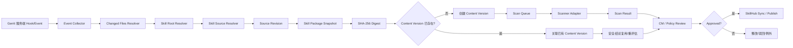

# Gerrit Skill 自动发现与安全审查技术方案

> 版本：v0.2  
> 当前范围：公司 Gerrit 仓库内 Skill

## 1. 目标

对公司 Gerrit 中的 Skill 实现：

- 历史全量盘点；
- 服务端统一增量发现；
- 以 `SKILL.md` 自动定位 Skill Root；
- Skill Root 内任意受管控文件变化可识别；
- Skill Source 与逻辑 Skill 分离；
- Git Revision 与内容 Digest 分离；
- 自动扫描、CM 审核与 SkillHub 纳管可追溯。

## 2. 已确认的识别规则

### 2.1 Skill Root

`SKILL.md` 所在目录即 Skill Root。

`SKILL.md` 是边界锚点，不是唯一的变更触发文件。

例如：

```text
jira-query-skill/
├── SKILL.md
├── scripts/query.py
└── references/api.md
```

只修改 `scripts/query.py` 时，仍应识别为 `jira-query-skill` 发生变化。

### 2.2 Skill Source

第一阶段使用以下组合识别一个 Skill Source：

```text
repository + skill_path + skill_name
```

任一字段不一致，先创建独立 Source。

后续若确认多个 Source 属于同一个逻辑 Skill，通过 `canonical_skill_id` 建立关联，不物理合并/删除 Source。

## 3. 总体架构



建议安全扫描异步执行，不在 Gerrit 关键提交线程里执行耗时深度扫描。

## 4. Baseline 全量盘点

服务端事件只能保证系统上线后的增量变化，因此上线前必须执行 Baseline。

### 流程

1. 获取纳管 Gerrit 仓库；
2. 明确正式纳管 branch；
3. 遍历 repository tree 查找 `SKILL.md`；
4. 将 `SKILL.md` 所在目录定义为 Skill Root；
5. 读取 `skill_name`；
6. 创建/定位 Skill Source；
7. 以当前 revision 创建 Source Revision；
8. 获取完整 Skill Package；
9. 计算 SHA-256 digest；
10. 创建或关联 Content Version；
11. 触发自动扫描；
12. 进入 CM 待办。

Baseline 必须可重复执行且幂等。

## 5. 增量事件处理

### 5.1 输入

服务端事件至少需要取得：

```text
repository
branch
change_id / event_id
patchset
revision_sha
parent_revision
changed_files
```

Changed File 需包含：

```text
status
old_path
new_path
```

状态覆盖：

- A：Add；
- M：Modify；
- D：Delete；
- R：Rename；
- C：Copy。

### 5.2 Skill Root Resolver

对 changed file：

1. 在新 revision 中从 `new_path` 向上寻找最近 `SKILL.md`；
2. Delete/Rename 时同时在 parent revision 使用 `old_path` 向上查找；
3. 如果 changed file 本身就是 `SKILL.md`，其目录直接作为 Skill Root；
4. 汇总受影响的 Skill Root 并去重；
5. 一个 commit 可能产生多个受影响 Skill，逐个处理。

### 5.3 新 Skill

若新 revision 中出现此前未登记的：

```text
repository + skill_path + skill_name
```

则创建新的 Skill Source。

### 5.4 已有 Skill

如果三元组合一致，定位现有 Source，并创建新的 Source Revision。

即使 digest 与上一个 Revision 相同，也必须保留新的 Source Revision 记录。

## 6. Source Revision 与 Content Version

### 6.1 Source Revision

每个不同 Git commit/revision 对应一条来源版本记录。

用于回答：

- 来自哪个 commit；
- 哪个 Change/Patchset；
- 谁提交；
- 当时 Skill Root 是什么；
- 该 revision 对应哪个内容版本。

### 6.2 Content Version

完整 Skill Package 经过 SHA-256 规范化摘要后得到 Content Version。

例如：

```text
Revision A -> Digest X
Revision B -> Digest Y
Revision C -> Digest Y
Revision D（其他 Source） -> Digest Y
```

系统中保留 4 个 Source Revision，但只有 X、Y 两个 Content Version。

### 6.3 为什么两者都需要

只用 commitid：

- cherry-pick/merge 后会产生不同 commit；
- 相同内容会重复扫描；
- 一个 commit 可能修改多个 Skill。

只用 digest：

- 无法完整追踪 Git 历史；
- 无法表达相同内容在何时、从哪个 Source 被引用。

因此两者必须同时存在。

## 7. Digest 计算

统一使用 SHA-256，不使用 MD5。

推荐算法：

1. 获取 Skill Root 下纳管文件；
2. 排除明确忽略项；
3. 相对路径统一编码和分隔符；
4. 路径排序；
5. 每个文件计算 SHA-256；
6. 规范化记录 `relative_path + file_digest + file_mode`；
7. 对完整清单再次计算 SHA-256。

示例：

```text
SKILL.md\0<sha256>\0<mode>
scripts/query.py\0<sha256>\0<mode>
references/api.md\0<sha256>\0<mode>
```

### 首版必须明确

- 换行符是否按 Git blob 原始内容计算；
- executable bit 是否纳入；
- symlink 是否允许；
- LFS 是否必须拉取真实对象；
- submodule 如何处理；
- 隐藏文件是否纳入；
- 大文件/二进制是否允许。

建议：Digest 尽量基于 Git tree/blob 内容计算，避免 checkout 环境差异造成不同机器 digest 不一致。

## 8. 内容版本复用逻辑

### 新 digest

```text
Source Revision
 -> 新 Content Version
 -> SCAN_PENDING
 -> Scanner
 -> CM Review
```

### 已存在 digest

```text
Source Revision
 -> 关联已有 Content Version
 -> 检查已有 Scan/Review 是否仍有效
```

安全结论复用至少需要满足：

- digest 相同；
- scanner/version 满足当前策略；
- policy_version 仍有效；
- 原结论未被 revoke；
- 没有触发强制重新扫描规则。

不能简单写成“digest 相同就永远不用再扫”。

## 9. Canonical Skill 合并

### 原则

发现阶段不承担复杂去重。

当仓库、路径、名称任一不同：

> 先登记为独立 Skill Source。

后续通过后台审核进行 Canonical 关联。

### 建议辅助信息

可展示：

- Skill name；
- description；
- 当前 digest；
- 历史 digest；
- Owner；
- 来源仓库；
- Source 创建时间。

如果多个 Source digest 完全相同，可以作为“疑似相同 Skill”的强提示，但仍建议保留人工确认能力。

### 合并操作

本质上是：

```text
source_a.canonical_skill_id = skill_001
source_b.canonical_skill_id = skill_001
```

而不是删除 Source B 或把历史搬到 Source A。

## 10. 自动扫描任务

扫描任务建议 key：

```text
content_version_id
+ scanner_name
+ scanner_version
+ policy_version
+ scan_mode
```

以避免：

- 服务端事件重复触发；
- 定时任务与实时任务重复执行；
- 同 digest 多个 Source 重复扫描。

扫描结果标准字段：

```text
scan_id
content_version_id
scanner_name
scanner_version
policy_version
status
risk_level
risk_score
started_at
finished_at
raw_report_ref
```

Finding 建议单独存储。

## 11. CM Review 逻辑

CM 页面建议展示：

- Canonical Skill（如已关联）；
- Skill Source；
- repository / path / name；
- Source Revision / commit；
- current digest；
- 与上一个 Source Revision 的 diff；
- 与上一个 Approved Content Version 的 diff；
- Scanner 结果；
- Findings；
- 历史审核记录；
- SkillHub 状态。

审核操作：

- Approve；
- Reject；
- Request Changes；
- Exception / Escalate（后续按公司流程实现）。

审核结论绑定 Content Version，而不是只绑定 Source Revision。

## 12. SkillHub 同步

推荐将安全状态和 SkillHub 同步状态分开。

例如：

```text
review_status = APPROVED
skillhub_status = NOT_SYNCED
```

同步成功后：

```text
skillhub_status = PUBLISHED
```

如果平台支持 Draft：

```text
DISCOVERED -> SkillHub DRAFT
APPROVED -> Publish
```

如果平台不适合保存未审资产，则：

```text
APPROVED -> Upload/Register -> Publish
```

无论采用哪一种，都不能因为 SkillHub 接口失败而修改已经形成的安全审核历史。

## 13. Rename / Move / Delete

### Rename / Move

如果路径改变导致 Source 三元组变化：

- 新路径按新 Source 登记；
- 旧 Source 标记 `MOVED/INACTIVE`；
- 保存迁移关系；
- 后续可将两者关联到同一个 Canonical Skill。

### Delete

删除 Skill Root 或 `SKILL.md`：

- Source 标记 inactive/deleted；
- 历史 Revision、Content Version、Scan、Review 不删除；
- 如果 SkillHub 已发布，由治理流程决定是否同步下架。

## 14. 并发与幂等

### 事件重复

建议按 Gerrit event id + revision 去重。

### Revision 任务幂等

建议唯一约束：

```text
source_id + revision_sha
```

### Content Version 幂等

建议唯一约束：

```text
skill_digest
```

是否全局唯一或 Canonical Skill 内唯一，可在 POC 中确认；首版推荐先全局内容表去重，再通过关联表连接 Skill。

### 审核时内容漂移

审核对象是具体 Content Version，因此旧版本审核完成可以正常保留。

但 UI 的“当前 Source 已通过”必须根据：

```text
source.current_revision.content_version.review_status
```

计算，禁止把旧 Revision 的 APPROVED 误投影给最新 Revision。

## 15. Reconciliation

服务端 Hook/Event 不是唯一数据正确性保障。

需要定时执行：

- Gerrit 当前正式 branch Skill 列表；
- 数据库当前 Source 列表；
- current revision；
- digest；

进行对账。

发现差异时补发事件或生成修复任务。

## 16. 第一版 MVP

必须实现：

- Baseline；
- Gerrit 服务端增量触发；
- A/M/D/R/C；
- Skill Root Resolver；
- Skill Source；
- Source Revision；
- SHA-256 Digest；
- Content Version；
- Scan Queue / Scanner 接入；
- CM Review；
- SkillHub Sync；
- 审计日志；
- Reconciliation。

暂缓：

- Runtime 可信源；
- 外部 Skill 引入；
- 动态沙箱；
- 数字签名；
- 自动 Canonical 合并；
- 全公司 Gerrit 强阻断。
