# Gerrit Skill 自动发现与安全审查技术方案

## 1. 目标

对公司 Gerrit 中的 Skill 做到：

- 历史全量盘点；
- 新增 Skill 自动发现；
- 已登记 Skill 变更自动识别；
- rename/delete/move 可追踪；
- 生成安全扫描与人工审核任务；
- 审批结果绑定具体内容；
- 发布状态与 Gerrit 来源可追溯。

## 2. 对当前流程图的评价

当前方案的主线是合理的：

```text
代码提交
 -> 识别提交文件
 -> 判断是否属于已登记 Skill
 -> 已登记：历史留存 + 更新版本 + 安全审查置否
 -> 新 Skill：登记 + 安全审查置否
```

优点：

- 能把 Skill 从普通仓库文件提升为独立资产；
- 有当前表与历史记录意识；
- 有“变更后重新审查”的核心思想。

但当前方案最需要调整的是：**识别和审查对象应该从“SKILL.md 文件”提升为“完整 Skill Root 内容版本”。**

## 3. 推荐事件架构

```mermaid
flowchart LR
  A[Gerrit patchset-created/ref-updated] --> B[Event Collector]
  B --> C[Message Queue]
  C --> D[Change Resolver]
  D --> E[Changed Files]
  E --> F[Skill Root Resolver]
  F --> G[Content Snapshot / Digest]
  G --> H[Inventory Service]
  H --> I[Scan Queue]
  I --> J[Scanner Adapter]
  J --> K[Policy Engine]
  K --> L[Review Queue]
  L --> M[Reviewer]
  M --> N[SkillHub Publish Gate]
```



### 关键设计

- Gerrit 只负责产生事件，不在提交线程做深度安全扫描；
- Event Collector 要快速返回；
- 所有后续动作异步化；
- 事件处理必须幂等；
- 发布/合入关键门禁再同步检查状态。

## 4. 为什么不建议只用 Git Hook

### 客户端 Git Hook

不适合作为公司强制安全控制：

- 可以不安装；
- 可以 `--no-verify`；
- 可以被覆盖；
- 不同操作系统环境不一致。

### 服务端 Gerrit Hook / Event

更适合做统一控制。

推荐结合：

- Gerrit `patchset-created`；
- `ref-updated`；
- Event Stream / 事件插件；
- CI Verification；
- Code Review Label；
- Submit Requirement。

## 5. Skill 识别算法

### 5.1 初次全量 Baseline

增量事件无法识别历史已有但从未变更的 Skill。

首次上线必须：

1. 获取所有纳管仓库；
2. 获取纳管 branch；
3. 遍历 tree 查找 `SKILL.md`；
4. 记录 Skill Root；
5. 校验目录；
6. 计算 digest；
7. 登记为 `DISCOVERED`；
8. 批量扫描；
9. 进入审核队列。

### 5.2 增量识别

输入 changed file：

```text
status, old_path, new_path
```

需支持：

- A add
- M modify
- D delete
- R rename
- C copy

对每个 path：

1. 在新 revision tree 中，从文件目录向上查找最近 `SKILL.md`；
2. rename/delete 时，在 parent/old revision 中也做同样查找；
3. 直接变更 `SKILL.md` 时，把所在目录作为 Skill Root；
4. 汇总受影响 Skill Root 集合；
5. 每个 Skill Root 单独处理。

### 5.3 边界规则

建议首版：

- 一个 Skill Root 内不得再包含另一个 `SKILL.md`；
- 若检测到嵌套，标记 `INVALID_PACKAGE`，人工确认；
- Skill Root 由包含 `SKILL.md` 的目录定义；
- Skill Package 包含该目录下所有纳入策略的普通文件。

## 6. Digest 设计

不建议只保存 commitid 判断“已审查”。

原因：

- cherry-pick 后 commitid 变化，但内容相同；
- 同一个 commit 可修改多个 Skill；
- 一个 Skill 的安全身份应该是完整内容；
- 某些分支合并会改变 commit 但不改变 Skill 内容。

### 6.1 推荐计算方式

对 Skill Root 内所有文件：

1. 路径按 UTF-8 正规化；
2. 路径排序；
3. 每个文件计算 SHA-256；
4. 对 `relative_path + file_digest + mode` 形成规范化清单；
5. 再计算 Skill Package SHA-256。

示例：

```text
skill_digest = sha256(
  "SKILL.md\0<sha256>\n" +
  "scripts/a.py\0<sha256>\n" +
  "references/a.md\0<sha256>\n"
)
```

### 6.2 特殊文件

- symlink：第一阶段建议禁止指向 Root 外；
- submodule：默认禁止；
- Git LFS：必须获取真实对象后再 digest；
- executable bit：纳入摘要或元数据；
- 大二进制：默认拒绝或走白名单。

## 7. 变更后的审查逻辑

### 7.1 新 Skill

```text
DISCOVERED
 -> VALIDATING
 -> SCAN_PENDING
 -> REVIEW_REQUIRED / AUTO_APPROVED
 -> APPROVED
 -> PUBLISHED
```

### 7.2 已批准 Skill 内容变化

旧版本记录不修改。

新版本：

```text
new digest
 -> STALE / SCAN_PENDING
 -> 扫描
 -> 根据风险决定人工审查
```

### 7.3 只改低风险资源

第一阶段建议：**仍重新自动扫描，但可以不强制人工复核。**

后续可以做 diff risk classification：

- 只修改 `.md` typo → Fast Path；
- 新增 `.sh/.py` → Mandatory Review；
- 权限扩大 → Mandatory Review；
- 新增外部 URL → Mandatory Review。

## 8. Gerrit 与审核门禁关系

有两种模式。

### 模式 A：发现与发布分离

开发代码可以先合入，但未审查 Skill 不允许发布到 SkillHub。

适用于初期，侵入性小。

### 模式 B：Gerrit 提交门禁

如果仓库内 Skill 属于强管控资产，则 Gerrit Submit Requirement 要求：

- `Skill-Security-Check +1`；或
- CI check 返回 Approved。

适用于成熟阶段。

### 推荐演进

```text
Phase 1：只发现，不阻塞 Gerrit
Phase 2：SkillHub 发布强制门禁
Phase 3：高风险 Skill Gerrit 合入强制门禁
```

避免第一天就把扫描器稳定性变成全公司 Gerrit 可用性的依赖。

## 9. 扫描任务设计

任务 key：

```text
skill_id + skill_digest + policy_version + scanner_name + scanner_version
```

保证：

- 幂等；
- 同一内容不重复扫描；
- Scanner 升级后可重新扫描；
- Policy 变化可重新决策。

扫描输出统一字段：

- finding_id；
- rule_id；
- category；
- severity；
- file_path；
- line/range；
- evidence；
- recommendation；
- scanner_name/version；
- raw_report_ref。

## 10. Review Queue

Reviewer 页面至少展示：

- Skill 元数据；
- 来源仓库/branch/path；
- 当前 revision；
- 当前 digest；
- 与上个 Approved digest 的 diff；
- 风险分级；
- Scanner Findings；
- scripts 列表；
- 外部 URL；
- 依赖；
- 工具/MCP 权限；
- 审查历史；
- Approve / Reject / Accept Risk。

## 11. 与附件现有表结构的映射

附件中：

### `skill_summary`

建议保留为当前状态投影：

- Skill 名称
- 仓库
- Skill 路径
- 最新 revision
- 最新 digest
- 当前 lifecycle_status
- 当前 review_status
- 当前 risk_level

### `skill_history`

建议不要只做“整行复制”。

拆成：

- `skill_version`
- `scan_result`
- `review_record`
- `audit_event`

这样一个版本可以有：

- 多次扫描；
- 多个 Scanner；
- 多次审核；
- 驳回后重审；
- 批准后撤销。

## 12. 常见异常与处理

### Scanner 超时

- 自动重试；
- 超过阈值进入 `SCAN_FAILED`；
- 不允许把 `SCAN_FAILED` 当通过；
- 发送运维告警。

### Gerrit 事件重复

以 event id / revision / digest 做幂等。

### Gerrit 事件丢失

定时 reconciliation：

- 对纳管 branch 最新 revision 与 inventory 做增量比对；
- 每日/每周执行低频补偿扫描。

### 同一 Skill 多个 patchset

旧扫描任务可以继续完成并留历史，但“当前待审核版本”只指向最新 digest；审批时必须再次确认 digest 未漂移。

### Skill 在审核过程中又被修改

审批提交时：

```text
if reviewed_digest != current_digest:
    reject approval as stale
```

## 13. 安全边界

事件发现系统自身不得：

- 执行 Skill 内脚本；
- source 任意 shell；
- 自动访问 Skill 中声明的 URL；
- 解压无大小限制压缩包；
- 使用高权限 Gerrit 管理账户。

扫描应读取内容，不执行不可信代码；动态验证必须放进隔离沙箱。

## 14. 第一版 MVP

必须实现：

- Gerrit baseline scan；
- patchset-created 事件；
- changed files；
- Skill Root Resolver；
- digest；
- 当前台账；
- 版本历史；
- 自动 scanner；
- 人工审核；
- Approved digest；
- SkillHub 发布门禁。

暂缓：

- 动态沙箱执行；
- 企业签名；
- 复杂行为评分；
- 自动修复；
- 多区域高可用。
