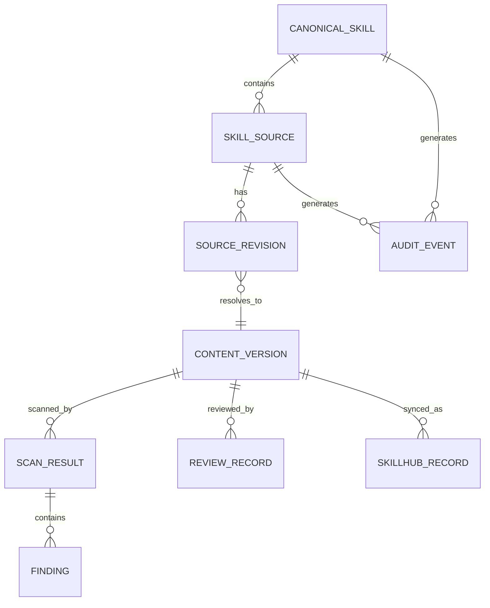

# Skill 安全治理数据模型建议

> 版本：v0.2

## 1. 设计原则

数据模型必须同时解决四类不同问题：

1. **逻辑资产**：多个引用来源是否属于同一个 Skill；
2. **来源追溯**：Skill 来自哪个仓库、目录、commit；
3. **内容识别**：两个来源/commit 的 Skill Package 内容是否完全一致；
4. **安全治理**：哪个内容版本被什么扫描器、什么策略扫描并最终审核。

核心原则：

> **Commit/Revision 是来源版本，Digest 是内容版本；安全结论绑定内容版本，Git 追溯绑定来源版本。**

`repository + skill_path + skill_name` 用于识别 Skill Source，不作为最终 Canonical Skill 唯一键。

---

## 2. 推荐实体关系



## 3. canonical_skill

表示逻辑上的同一个 Skill 能力。

```text
canonical_skill_id PK
canonical_name
display_name
description
owner_team
status
created_by
created_at
updated_at
```

### 说明

- 可以先创建“临时 Canonical Skill”，一个 Source 默认对应一个 Canonical；
- 后续多个 Source 被确认属于同一个逻辑 Skill 时，只修改关联关系；
- 不删除原 Source 和 Revision；
- 需要支持误合并后的拆分。

---

## 4. skill_source

表示 Skill 的一个具体代码来源。

第一阶段来源识别键：

```text
repository + skill_path + skill_name
```

建议字段：

```text
source_id PK
canonical_skill_id FK
scm_type               # gerrit
repository
branch
skill_path
skill_name
owner_team
status                  # ACTIVE/INACTIVE/DELETED/MOVED
moved_from_source_id nullable
first_seen_at
last_seen_at
created_at
updated_at
```

### 唯一约束

建议首版：

```text
UNIQUE(repository, branch, skill_path, skill_name)
```

如果最终确认 branch 不属于 Source 身份的一部分，可以在实施前调整；但必须先明确纳管 branch 语义。

---

## 5. source_revision

表示某个 Skill Source 在某次 Git revision 下的不可变快照。

```text
source_revision_id PK
source_id FK
gerrit_change_id nullable
patchset_number nullable
revision_sha
parent_revision_sha nullable
merged_commit_sha nullable
content_version_id FK
change_type             # ADD/MODIFY/DELETE/RENAME/COPY/BASELINE
author
committer
commit_time
observed_at
```

### 唯一约束

```text
UNIQUE(source_id, revision_sha)
```

### 规则

- 同一 Source 的不同 revision 都必须保存；
- 即使两个 revision 最终 digest 相同，也不能删除 revision；
- Source Revision 是 Git 事实，不承载最终安全结论。

---

## 6. content_version

表示真实 Skill Package 内容版本。

```text
content_version_id PK
skill_digest
hash_algorithm          # SHA-256
package_manifest
file_count
package_size
created_at
```

建议：

```text
UNIQUE(skill_digest)
```

### 说明

同一个 Content Version 可以被多个 Source Revision 引用。

例如：

```text
A/commit1 -> Digest X
A/commit2 -> Digest Y
A/commit3 -> Digest Y
B/commit8 -> Digest Y
```

数据库中：

- 4 条 source_revision；
- 2 条 content_version。

### 是否全局按 digest 去重

首版建议全局按内容去重，因为完全相同的 Skill Package 没有必要重复扫描。

如果后续发现同内容在不同业务上下文中需要独立安全决策，可以将 Review Policy 增加上下文维度，而不必放弃内容去重。

---

## 7. package_manifest

建议保存规范化 Manifest，方便解释 digest。

示例：

```json
[
  {
    "path": "SKILL.md",
    "sha256": "...",
    "mode": "100644"
  },
  {
    "path": "scripts/query.py",
    "sha256": "...",
    "mode": "100755"
  }
]
```

Digest 推荐使用 Manifest 规范化内容再做 SHA-256。

不使用 MD5。

---

## 8. scan_result

一次扫描任务一条记录。

```text
scan_id PK
content_version_id FK
scanner_name
scanner_version
policy_version
scan_mode
status                  # PENDING/RUNNING/PASSED/FAILED/ERROR/TIMEOUT
risk_score nullable
risk_level nullable
started_at
finished_at
raw_report_ref nullable
error_message nullable
created_at
```

### 幂等键

```text
content_version_id
+ scanner_name
+ scanner_version
+ policy_version
+ scan_mode
```

这样可以避免：

- 同 digest 多个 Source 重复扫描；
- 实时事件和定时任务重复扫描；
- 重复 Gerrit Event 产生多份相同任务。

---

## 9. finding

```text
finding_id PK
scan_id FK
external_finding_id nullable
rule_id
category
severity
title
description
file_path nullable
start_line nullable
end_line nullable
evidence nullable
recommendation nullable
fingerprint
status                  # OPEN/FIXED/ACCEPTED/FALSE_POSITIVE
created_at
updated_at
```

建议 fingerprint 基于：

```text
rule_id + normalized_path + normalized_evidence
```

便于比较扫描器重复发现的问题。

---

## 10. review_record

审核绑定 Content Version。

```text
review_id PK
content_version_id FK
review_type              # CM/SECURITY/EXCEPTION
reviewer
reviewer_role
decision                 # APPROVE/REJECT/REQUEST_CHANGES/EXCEPTION
policy_version
comment
created_at
```

如果后续需要按 Source 上下文单独审批，可以增加：

```text
source_id nullable
```

但默认安全内容结论应首先复用 Content Version。

---

## 11. skillhub_record

SkillHub 同步状态独立于安全审核状态。

```text
skillhub_record_id PK
canonical_skill_id FK
source_id nullable
content_version_id FK
skillhub_skill_id nullable
skillhub_version_id nullable
sync_status              # NOT_SYNCED/DRAFT/PUBLISHED/OFFLINE/REVOKED/ERROR
sync_error nullable
synced_by nullable
synced_at nullable
published_at nullable
offlined_at nullable
created_at
updated_at
```

### 关键规则

以下状态完全可能同时存在：

```text
review_status = APPROVED
skillhub_status = ERROR
```

表示安全审核已经完成，只是 SkillHub 同步失败。

不得因为 SkillHub API 失败而覆盖安全事实。

---

## 12. source_merge_history

建议增加 Source 与 Canonical Skill 关联历史，而不是只修改外键后无记录。

```text
merge_event_id PK
source_id
old_canonical_skill_id
new_canonical_skill_id
operation                # LINK/UNLINK/MOVE
reason
operator
created_at
```

用于回答：

- 谁把两个 Source 认定为同一个 Skill；
- 为什么合并；
- 何时重新拆分。

---

## 13. audit_event

```text
audit_id PK
canonical_skill_id nullable
source_id nullable
source_revision_id nullable
content_version_id nullable
event_type
actor_type
actor_id
old_state nullable
new_state nullable
metadata
created_at
```

事件示例：

- SOURCE_DISCOVERED；
- SOURCE_MOVED；
- SOURCE_DELETED；
- REVISION_CREATED；
- CONTENT_VERSION_CREATED；
- CONTENT_VERSION_REUSED；
- SCAN_STARTED；
- SCAN_COMPLETED；
- REVIEW_APPROVED；
- REVIEW_REJECTED；
- SOURCE_LINKED_TO_CANONICAL；
- SOURCE_UNLINKED；
- SKILLHUB_DRAFT_CREATED；
- SKILLHUB_PUBLISHED；
- SKILLHUB_SYNC_FAILED。

---

## 14. 当前视图 skill_summary

附件中的 `skill_summary` 可以保留为 CM 日常使用的查询视图，但不作为事实历史表。

推荐展示：

```text
canonical_skill_id
skill_name
repository
branch
skill_path
source_id
latest_revision_sha
latest_digest
scan_status
review_status
skillhub_status
risk_level
updated_at
```

其中：

```text
latest_revision_sha
```

来自最新 Source Revision；

```text
latest_digest
```

来自该 Revision 关联的 Content Version。

---

## 15. 状态模型

### Scan Status

```text
NOT_SCANNED
PENDING
RUNNING
PASSED
FAILED
ERROR
TIMEOUT
```

### Review Status

```text
NOT_REVIEWED
PENDING
APPROVED
REJECTED
EXCEPTION
STALE
```

### SkillHub Status

```text
NOT_SYNCED
DRAFT
PUBLISHED
OFFLINE
REVOKED
ERROR
```

UI 可以进一步聚合成：

```text
DISCOVERED
SCANNING
REVIEWING
APPROVED
PUBLISHED
BLOCKED
```

但事实表不要只存一个总状态。

---

## 16. 数据示例

假设：

```text
repoA/skills/jira-query
name = jira-query-skill
```

经历：

```text
commit 111 -> digest AAA
commit 222 -> digest BBB
commit 333 -> digest BBB
```

另一个来源：

```text
repoB/common/jira
name = jira-query-skill
commit 999 -> digest BBB
```

应表现为：

```text
Canonical Skill: jira-query-skill
├── Source A
│   ├── Revision 111 -> AAA
│   ├── Revision 222 -> BBB
│   └── Revision 333 -> BBB
└── Source B
    └── Revision 999 -> BBB

Content AAA
└── Scan/Review

Content BBB
└── Scan/Review
```

这可以同时满足：

- 每个 commit 都可追；
- 同内容不重复保存；
- 同内容不必无意义重复扫描；
- 多个引用来源不会丢失。

---

## 17. 需要在开发前最终确认的字段决策

1. `branch` 是否进入 Skill Source 唯一键；
2. `skill_name` 是取 SKILL.md frontmatter 还是目录名，冲突时如何处理；
3. Digest 忽略哪些文件；
4. 换行符、文件 mode、symlink、LFS 的规范化规则；
5. Content Version 是否全局 digest 去重；
6. 相同 digest 在不同 Canonical Skill 下是否允许共享 Review；
7. SkillHub 一个版本对应 Source Revision 还是 Content Version；
8. 删除/移动 Source 后 SkillHub 是否自动下架。
