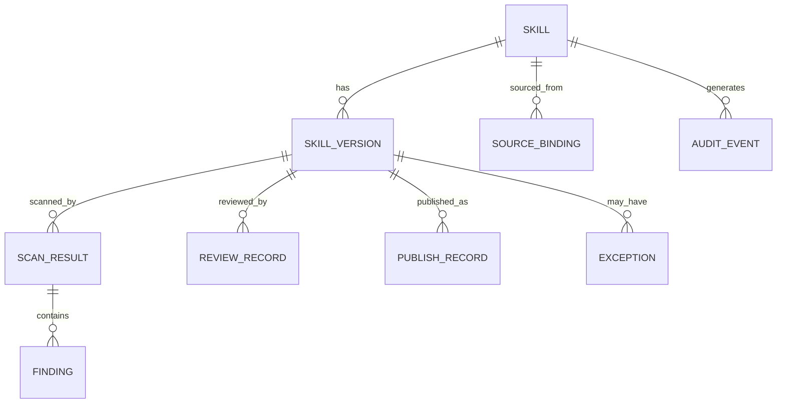

# Skill 安全治理数据模型建议

## 1. 设计原则

当前附件中 `skill_summary + skill_history` 的方向可以保留，但生产数据模型建议进一步拆分，避免把“Skill 当前信息、版本、扫描、审核、审计”全部塞进两张表。

核心原则：

- 当前状态与不可变历史分离；
- Skill 身份与 Skill 内容版本分离；
- 扫描记录与人工审核记录分离；
- commit/revision 是来源信息，digest 是内容身份；
- 所有关键状态变化保留 audit event。

---

## 2. 核心实体



## 3. skill

表示逻辑 Skill 资产。

建议字段：

```text
skill_id PK
namespace
name
display_name
description
owner_team
owner_user
risk_level
current_version_id
current_digest
lifecycle_status
review_status
created_at
updated_at
```

说明：

- `skill_id` 建议使用 UUID/平台 ID；
- name 不是全局唯一；
- namespace + canonical slug 可做业务唯一键。

---

## 4. source_binding

表示 Skill 与 SCM/外部来源的绑定。

```text
source_binding_id PK
skill_id FK
source_type          # gerrit/github/gitlab/upload/external
repository
branch
skill_path
gerrit_change_id
patchset_number
revision_sha
merged_commit_sha
external_url
external_version
source_digest
is_canonical
created_at
```

### 说明

对于 Gerrit，不建议只保留 `commitid`。

至少要区分：

- Change-Id；
- Patchset；
- Revision SHA；
- Merge Commit。

---

## 5. skill_version

每个内容版本一条记录，不可覆盖。

```text
version_id PK
skill_id FK
semantic_version
skill_digest
source_binding_id
package_manifest
file_count
package_size
change_type
previous_version_id
created_by
created_at
```

### 唯一约束建议

```text
UNIQUE(skill_id, skill_digest)
```

如果同一内容被多次提交，可增加 source binding，而无需重复创建 version。

---

## 6. scan_result

一次扫描任务一条记录。

```text
scan_id PK
version_id FK
scanner_name
scanner_version
policy_version
scan_mode           # static/semantic/dependency/etc
status              # pending/running/success/failed/timeout
risk_score
risk_level
started_at
finished_at
raw_report_ref
error_message
```

### 幂等键

建议：

```text
version_id + scanner_name + scanner_version + policy_version + scan_mode
```

---

## 7. finding

统一不同扫描器结果。

```text
finding_id PK
scan_id FK
external_finding_id
rule_id
category
severity
title
description
file_path
start_line
end_line
evidence
recommendation
fingerprint
status              # open/accepted/fixed/false_positive
created_at
```

### fingerprint

建议根据：

```text
rule_id + normalized_path + normalized_evidence
```

生成，便于比较新旧扫描结果。

---

## 8. review_record

人工审核记录。

```text
review_id PK
version_id FK
review_type          # security/owner/compliance
reviewer
reviewer_role
decision             # approve/reject/request_changes/approve_with_exception
reviewed_digest
policy_version
comment
created_at
```

### 关键规则

`reviewed_digest` 必须与审批提交时当前 version digest 一致。

审批接口必须做乐观校验：

```text
reviewed_digest == current_target_digest
```

否则返回 `STALE_REVIEW`。

---

## 9. exception

风险接受/豁免。

```text
exception_id PK
version_id FK
finding_id nullable
risk_description
justification
compensating_control
requester
approver
approved_at
expire_at
status
```

任何例外必须有到期或取消条件。

---

## 10. publish_record

记录上架行为。

```text
publish_id PK
version_id FK
registry
namespace
published_version
published_digest
status
published_by
published_at
offlined_at
revoked_at
revoke_reason
```

`published_digest` 不允许被原地修改。

---

## 11. audit_event

所有关键操作的统一审计事件。

```text
audit_id PK
skill_id
version_id nullable
event_type
actor_type
actor_id
source_ip / client_id (按公司审计政策)
old_state
new_state
metadata
created_at
```

事件例子：

- SKILL_DISCOVERED；
- VERSION_CREATED；
- SCAN_STARTED；
- SCAN_COMPLETED；
- REVIEW_APPROVED；
- REVIEW_REJECTED；
- RISK_ACCEPTED；
- PUBLISHED；
- OFFLINED；
- REVOKED；
- OWNER_CHANGED；
- POLICY_REEVALUATED。

---

## 12. current summary / materialized view

如果 CM 日常需要类似附件中的 `skill_summary`，建议它成为“当前视图/投影”，而不是所有历史的事实表。

展示字段：

```text
skill_id
skill_name
repository
branch
skill_path
latest_revision
latest_digest
risk_level
scan_status
review_status
publish_status
latest_policy_version
latest_reviewer
updated_at
```

---

## 13. 状态机

建议将“扫描状态、审核状态、发布状态”分离，不要做成一个过度复杂的单状态字段。

### Scan Status

```text
NOT_SCANNED
PENDING
RUNNING
PASSED
FAILED
ERROR
```

### Review Status

```text
NOT_REQUIRED
PENDING
IN_REVIEW
APPROVED
REJECTED
STALE
EXCEPTION
```

### Publish Status

```text
NOT_PUBLISHED
PUBLISHED
OFFLINE
REVOKED
```

### 聚合 Lifecycle

供 UI 简化展示：

```text
DISCOVERED
REVIEWING
APPROVED
PUBLISHED
STALE
REJECTED
REVOKED
```

---

## 14. 为什么 Boolean `是否经过安全审查` 不够

Boolean 无法表达：

- 扫描正在执行；
- 扫描失败；
- 人工待审；
- 已驳回；
- 有风险例外；
- 已批准但内容变更；
- 已批准但策略升级后需要复审；
- 已发布后被撤销。

所以附件中的“是否经过安全审查”建议在 UI 中仍可以显示“是/否”，但底层必须使用完整状态和记录。
