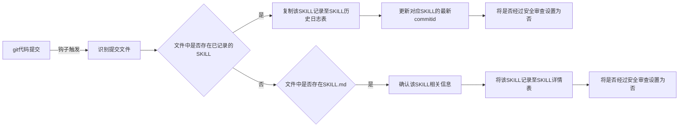
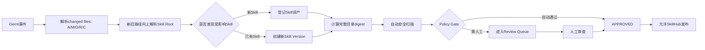

# 当前 Skill 安全审查流程草图复现与说明

本文将最初方案图中的关键结构转成可版本化的 Mermaid/Markdown，便于后续评审和修改。

## 1. 当前 `skill_summary` 草图

| SKILL名称 | 仓库名称 | SKILL所在路径 | 最新commitid | 是否经过安全审查 |
| --- | --- | --- | --- | --- |
| jira-query-skill | Skill-CM | JIRA相关查询/jira-query-skill | 示例 revision | 是 |

## 2. 当前 `skill_history` 草图

| SKILL名称 | 仓库名称 | SKILL所在路径 | commitid | 更新序号 |
| --- | --- | --- | --- | ---: |
| jira-query-skill | Skill-CM | JIRA相关查询/jira-query-skill | 示例 revision | 1 |

## 3. 当前流程复现

## 4. 原方案判断逻辑

原方案在“是否属于已登记 Skill”处考虑：

1. 判断仓库是否为已有 Skill 的仓库；
2. 判断第一层路径是否一致；
3. 逐层判断。

## 5. 建议升级方向

原流程建议升级为：

核心变化：

- 不再只看“新增文件是否包含 `SKILL.md`”；
- 不再只把 commitid 作为审查版本；
- 改为完整 Skill Package 的 digest；
- 支持 scripts-only change、rename、delete、多 Skill commit；
- Boolean 审查字段升级为完整状态机；
- 扫描、审核、发布分别留不可变记录。
