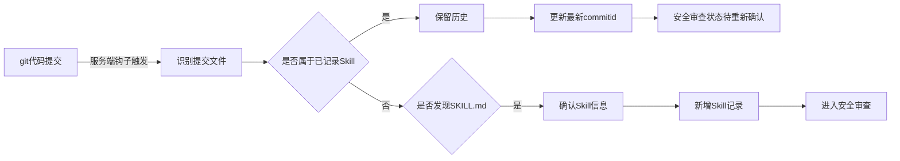
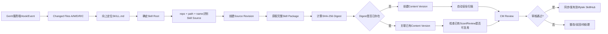

# 当前 Skill 安全审查流程草图复现与升级说明

> 版本：v0.2

本文保留最初方案思路，同时将当前已经确认的设计决策映射到新版流程。

## 1. 原始 `skill_summary` 草图

| SKILL名称 | 仓库名称 | SKILL所在路径 | 最新commitid | 是否经过安全审查 |
| --- | --- | --- | --- | --- |
| jira-query-skill | Skill-CM | JIRA相关查询/jira-query-skill | 示例 revision | 是 |

## 2. 原始 `skill_history` 草图

| SKILL名称 | 仓库名称 | SKILL所在路径 | commitid | 更新序号 |
| --- | --- | --- | --- | ---: |
| jira-query-skill | Skill-CM | JIRA相关查询/jira-query-skill | 示例 revision | 1 |

## 3. 原方案流程



原方案核心思想仍然保留：

- Git 服务端统一触发；
- 自动发现新 Skill；
- Skill 变更后重新进入治理；
- 保留历史版本；
- 通过后进入 SkillHub。

## 4. 当前已经确认的设计补充

### 4.1 `SKILL.md` 的定位

`SKILL.md` 是 Skill 边界锚点。

```text
SKILL.md 所在目录 = Skill Root
```

但变更识别不能只看 `SKILL.md`。

Skill Root 内：

```text
scripts
references
assets
config
其他纳管文件
```

任意变化都要被识别为该 Skill 的变化。

### 4.2 Skill Source 判断

首版以：

```text
repository + skill_path + skill_name
```

识别一个 Source。

三者任一不同，先独立登记。

后续如果确认属于同一个 Skill：

```text
Source A ─┐
          ├─> Canonical Skill
Source B ─┘
```

不删除原 Source。

### 4.3 版本不再只有 commitid

当前模型：

```text
Source Revision = Git commit/revision
Content Version = SHA-256 skill_digest
```

例如：

```text
commit A -> digest X
commit B -> digest Y
commit C -> digest Y
```

表示：

- Git 来源版本有 3 个；
- 实际内容版本有 2 个。

安全扫描和审核主要绑定 digest。

## 5. 新版核心流程



## 6. 与原表结构的升级映射

### 原 `skill_summary`

仍可作为 CM 当前视图，但建议字段升级为：

| 字段 | 说明 |
| --- | --- |
| Skill名称 | 展示名称 |
| 仓库 | Source repository |
| 路径 | Source path |
| Source ID | 仓库+路径+name对应来源 |
| 最新commit | 最新 Source Revision |
| 最新digest | 当前 Content Version |
| Scan Status | 自动扫描状态 |
| Review Status | CM审核状态 |
| SkillHub Status | 同步/发布状态 |
| Canonical Skill | 如已完成多来源关联 |

### 原 `skill_history`

不建议继续用“复制当前行”的方式承担全部历史。

建议拆成：

```text
skill_source
source_revision
content_version
scan_result
finding
review_record
skillhub_record
audit_event
```

## 7. 一个具体示例

### 来源 A

```text
repository: Skill-CM
path: JIRA相关查询/jira-query-skill
name: jira-query-skill
```

历史：

```text
commit 111 -> digest AAA
commit 222 -> digest BBB
commit 333 -> digest BBB
```

### 来源 B

```text
repository: Common-Skills
path: jira/jira-query-skill
name: jira-query-skill
commit 999 -> digest BBB
```

系统应表示为：

```text
Canonical Skill: jira-query-skill
├── Source A
│   ├── Revision 111 -> Content AAA
│   ├── Revision 222 -> Content BBB
│   └── Revision 333 -> Content BBB
└── Source B
    └── Revision 999 -> Content BBB

Content AAA
└── Scan/Review A

Content BBB
└── Scan/Review B
```

这样既能满足“每个 commit 都是一个来源版本”，也能避免相同内容被重复定义成多个安全内容版本。

## 8. 关键异常场景

新版流程必须覆盖：

- `SKILL.md` 不变，只修改 scripts；
- rename/move；
- 删除 `SKILL.md`；
- copy Skill；
- 一个 commit 修改多个 Skill；
- 相同 digest 的重复 commit；
- 不同仓库引用相同 digest；
- 服务端事件重复；
- 扫描任务重复；
- Scanner 超时；
- SkillHub 同步失败。

## 9. 当前第一阶段边界

当前只治理已经进入 Gerrit 的 Skill。

暂不在首版解决：

- 公网 Skill 怎么进入公司；
- 用户本地临时 Skill；
- Runtime 强制只能用 SkillHub；
- 外部 Skill 下载控制。

第一阶段先把：

```text
Gerrit -> 发现 -> 版本 -> Digest -> 扫描 -> CM审核 -> SkillHub
```

闭环做稳定。
