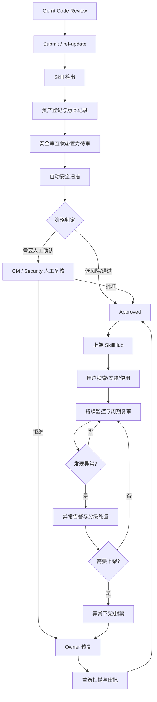
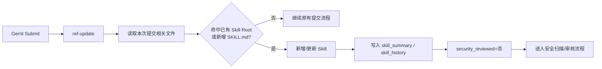
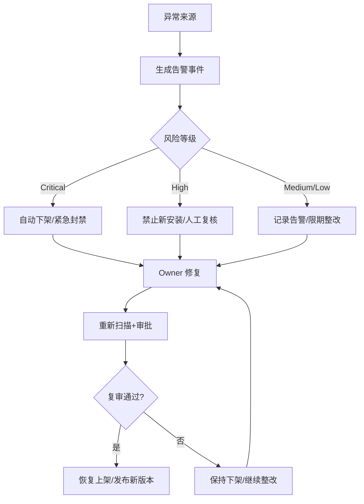

# 企业内部 Skill 安全治理体系建设方案

**副标题：基于 Gerrit `ref-update` 与企业 SkillHub 的 Skill 全生命周期安全管理策略**

- 文档版本：V1.0
- 编制日期：2026-08-26
- 适用阶段：第一阶段建设及后续演进
- 当前实现基础：Gerrit `ref-update` + MySQL Skill 台账 + SkillHub

---

## 1. 执行摘要

随着 Agent、Coding Assistant 和企业内部 AI 工具逐步引入 Skill 机制，Skill 已从单纯的提示词文件演变为包含指令、脚本、依赖、网络访问、文件操作和凭据使用能力的可执行知识组件。其安全属性更接近“轻量级软件包 + 自动化脚本 + AI 指令”的组合，因此仅依靠代码仓库权限或人工 Code Review，难以覆盖 Skill 的完整供应链风险。

本方案以公司现有 Gerrit 研发流程为可信来源入口，以当前 `release/hooks/ref-update` 实现作为日常变更检出机制，以 MySQL 维护 Skill 资产与版本台账，并以企业 SkillHub 作为审核后 Skill 的统一可信分发入口，形成从 **发现、登记、变更、扫描、审批、发布、使用、监控、告警、下架到恢复** 的闭环治理体系。

第一阶段重点不是建设一个复杂的“AI 安全平台”，而是先建立三个关键控制面：

1. **来源可控**：正式纳管 Skill 必须来源于公司 Gerrit 受控仓库；
2. **版本可追溯**：每次 Skill 变化均能够定位到仓库、分支、路径和 Commit；
3. **发布可控**：未完成安全审查的版本不得作为公司可信 Skill 发布到 SkillHub。

建议将 SkillHub 定位为“**可信 Skill 分发平台**”，而非单纯的 Skill 展示或下载网站。Gerrit 中存在 Skill，并不等于该 Skill 已被公司认可；只有通过安全扫描和治理审批的具体版本，才进入 SkillHub 的可用范围。

---

## 2. 建设背景与治理目标

### 2.1 风险背景

企业 Skill 通常可能包含以下能力：

- 对大模型行为进行高优先级指令约束；
- 读取或修改本地文件；
- 调用 Shell、Python、PowerShell 等执行环境；
- 调用公司内网或公网接口；
- 读取 Token、密钥、环境变量等凭据；
- 安装第三方依赖或执行依赖脚本；
- 将业务数据传递给外部服务；
- 通过 references、scripts、assets 等辅助文件扩大实际执行边界。

因此，Skill 的主要风险不仅是“代码是否有漏洞”，还包括指令越权、提示注入、数据泄漏、敏感资源访问、恶意依赖、供应链污染以及审核后版本被替换等问题。

### 2.2 治理目标

本体系目标是实现：

- 公司正式 Skill 资产可发现、可盘点；
- Skill 来源、版本、Owner 和发布状态可追溯；
- Skill 发生变化后能够自动重新进入待审状态；
- 通过自动扫描和人工复核识别高风险行为；
- 审核通过的版本才能进入 SkillHub；
- 已发布 Skill 出现新风险时能够告警、下架并恢复；
- 全生命周期操作具有审计证据；
- 在不明显阻塞 Gerrit 正常研发流程的前提下逐步增强安全门禁。

---

## 3. 治理范围与信任边界

### 3.1 第一阶段纳管范围

第一阶段建议只纳管：

- 已进入公司 Gerrit 的 Skill；
- 由 `SKILL.md` 标识的 Skill 目录；
- Gerrit 受控仓库、受控分支中用于正式交付或共享的 Skill；
- 计划上架企业 SkillHub 的 Skill。

### 3.2 第一阶段暂不纳管范围

以下内容建议暂不作为首期强制治理范围：

- 开发人员本地临时 Skill；
- 用户自行从公网 GitHub、社区 SkillHub 下载的 Skill；
- 终端侧 `~/.claude/skills`、本地 Agent Skill 目录的强制白名单；
- Skill 每一次运行时文件访问、网络访问的实时审计；
- 复杂的跨仓库 Canonical Skill 自动合并；
- 对所有 AI 行为进行实时 SIEM 级别监控。

这些能力有价值，但首期投入大、边界复杂，容易让项目从“Skill 供应链治理”扩张为“终端 AI Runtime 安全平台”。建议在基础治理闭环稳定后再建设。

### 3.3 信任边界

本方案定义三层信任：

| 层级 | 含义 | 是否代表公司可信 |
|---|---|---|
| Gerrit Source | Skill 已进入公司代码管理体系 | 否，仅表示来源可追溯 |
| Security Approved | 指定 Skill 版本完成扫描/审核 | 是，代表该版本满足当前策略 |
| SkillHub Published | 审核版本已发布到统一 SkillHub | 是，作为公司推荐/允许使用版本 |

核心原则：**Gerrit 是可信来源，不等于可信内容；SkillHub 是审核后可信内容的分发入口。**

---

## 4. 总体安全治理架构

### 4.1 全生命周期流程



### 4.2 当前 `ref-update` 实现的定位

当前 `release/hooks/ref-update` 应定位为 **Skill 变更发现与治理入口**，而不是把所有安全能力都塞进 Hook 本身。



在治理策略上，`ref-update` 的核心职责应保持轻量：识别、登记、状态变更和必要的快速校验。耗时较长的深度扫描、LLM 分析和人工审批应尽量从 Gerrit 同步 Hook 中解耦。

---

## 5. Skill 资产与版本管理

### 5.1 Skill 定义

以 `SKILL.md` 作为 Skill 的识别锚点，其所在目录作为 Skill Root。Skill Root 下纳入治理的文件共同构成 Skill Package。

第一阶段 Skill 身份建议继续沿用当前实现习惯：

```text
repo_name + branch + skill_path + skill_name
```

该模型简单、易于在当前 MySQL 台账中落地，并能直观区分 master、develop、release 等分支上的 Skill 状态。

### 5.2 当前数据模型

当前方案使用两张核心表：

| 表 | 作用 |
|---|---|
| `skill_summary` | 保存每个 Skill 当前最新版本、路径和安全审核状态 |
| `skill_history` | 保存同一 Skill 的历史 Commit/更新序列 |

第一阶段可以继续采用该模型，不必立即引入复杂的 Canonical Skill、Content Version 等对象。

### 5.3 版本原则

当前阶段以 Commit ID 作为 Skill 来源版本标识：

```text
Skill A
  V1 -> commit AAA
  V2 -> commit BBB
  V3 -> commit CCC
```

建议后续再增加完整 Skill Package Digest，用于识别“Commit 不同但内容相同”的情况，从而复用安全扫描结果。但该能力不是首期上线的前置条件。

### 5.4 Baseline 与增量治理

完整资产治理必须包含两个机制：

**Baseline：** 上线前对纳管 Gerrit 仓库进行一次全量盘点，发现历史已存在的 `SKILL.md` 并初始化台账。

**Incremental：** 上线后由 `ref-update` 对日常提交增量识别 Skill 变化。

若缺少 Baseline，历史 Skill 仅修改子文件、而本次提交未涉及 `SKILL.md` 时，增量机制可能无法判断该目录属于一个既有 Skill。因此 Baseline 是正式上线的必要准备工作。

### 5.5 变更后的审查状态失效

任何已纳管 Skill 的有效内容发生变化后，应自动将最新版本设置为待审：

```text
原版本：security_reviewed = 是
        ↓
Skill Root 内容发生变化
        ↓
新版本：security_reviewed = 否
```

但新版本待审不应自动否定上一已发布版本。SkillHub 可以继续提供上一批准版本，直到新版本完成审核后再替换。

---

## 6. Skill 安全审查策略

### 6.1 审查目标

安全审查的目标不是证明 Skill “绝对安全”，而是在公司当前风险策略、Scanner 规则和业务上下文下，判断该具体版本是否满足发布要求，并留下可追溯的证据。

### 6.2 自动扫描维度

建议至少覆盖以下七类：

| 扫描域 | 典型风险 | 重点检查 |
|---|---|---|
| 指令安全 | 越权、提示注入、隐藏指令 | SKILL.md 中是否诱导绕过限制、覆盖安全要求或隐藏行为 |
| 代码执行 | 任意命令、RCE | `exec/eval`、Shell、PowerShell、动态命令拼接 |
| 文件访问 | 越界读取、删除、覆盖 | 敏感目录、任意路径、递归删除、写系统目录 |
| 网络访问 | 数据外传、恶意下载 | 外部 URL、上传行为、任意网络请求、未知域名 |
| 凭据安全 | Token/密码泄漏 | 硬编码 Secret、读取敏感环境变量、凭据输出日志 |
| 依赖安全 | 供应链污染 | pip/npm 依赖、远程安装脚本、已知漏洞依赖 |
| 数据安全 | 敏感信息泄漏 | 用户数据、代码、配置、日志被发送到未批准目的地 |

特殊文件类型应至少产生风险提示，包括 symlink、submodule、Git LFS、binary、压缩包、Office/PDF、可执行文件等。

### 6.3 风险等级

统一风险分级建议：

| 等级 | 定义 | 默认处置 |
|---|---|---|
| Critical | 明确恶意、凭据窃取、严重数据外传、可直接导致重大安全事件 | 禁止发布；已发布则紧急下架 |
| High | 高概率造成越权、执行、泄漏或供应链风险 | 禁止自动发布，必须 Security 复核 |
| Medium | 有风险但可能属于业务合理行为 | 人工确认或有效例外后发布 |
| Low | 低影响、低概率问题 | 可自动通过或抽检 |
| Info | 信息提示 | 记录，不阻断 |

### 6.4 自动扫描与人工复核的边界

不建议所有 Skill 都由 CM 逐行审核。推荐采用：

```text
自动扫描
  ├─ 无风险 / Low -> 自动通过或抽检
  ├─ Medium -> CM/Owner 业务确认
  └─ High / Critical -> Security 人工复核
```

CM 的定位应是治理流程 Owner，而不是承担所有技术安全判断；高风险问题应升级 Security。

---

## 7. 安全审批与例外管理

### 7.1 扫描通过不等于自动批准

Scanner 输出属于技术检测结果，最终发布状态应由公司策略判定。部分业务合理 Skill 可能因为需要访问 Jira、Git、数据库或企业 API 而触发网络/凭据类规则，因此需要保留人工审批与例外机制。

### 7.2 例外管理要求

例外必须至少记录：

- Skill 名称和版本；
- 风险项/规则编号；
- 业务必要性；
- 申请人；
- 审批人；
- 补偿控制；
- 有效期；
- 到期后处理方式。

不建议采用“永久忽略规则”。例外到期或 Skill 版本变化后，应重新评估。

### 7.3 推荐审批状态

策略层建议逐步从当前“是/否”演进为：

```text
PENDING -> SCANNING -> PASSED / FAILED / EXCEPTION
```

第一阶段数据库仍可以保留 `security_reviewed=是/否`，策略文档先定义目标状态即可。

---

## 8. SkillHub 上架与发布管理

### 8.1 SkillHub 的治理定位

SkillHub 应作为公司统一的 **可信 Skill 发布和分发入口**。其核心价值包括：

- 统一展示经过批准的 Skill；
- 隔离“代码仓库中的开发版本”和“正式可用版本”；
- 统一记录发布版本、Owner、安全状态和审查时间；
- 为用户提供清晰的可信安装来源；
- 为后续使用统计、下架、版本升级提供平台基础。

因此该环节价值很高，应作为第一阶段核心闭环之一。

### 8.2 上架准入条件

一个 Skill 版本至少满足以下条件后方可发布：

- 来源属于公司纳管 Gerrit；
- Skill 身份和版本明确；
- 自动安全扫描完成；
- 不存在未处置的 Critical/High 风险；
- 需要人工审核时已完成审批；
- 例外项在有效期内；
- Owner 信息有效。

### 8.3 版本发布策略

建议采用“批准版本替换”模式：

```text
SkillHub 当前：V1 Approved / Published
Gerrit 新版本：V2 Pending
```

V2 未通过前，SkillHub 继续提供 V1。V2 通过后再发布 V2，并将 V1 标记为历史版本或停止新安装。

### 8.4 SkillHub 页面应展示的治理信息

至少建议展示：

- Skill 名称、描述；
- 来源仓库、分支、路径；
- 发布版本/Commit；
- Skill Owner；
- 安全状态；
- 风险等级；
- 最近审查时间；
- 最近更新时间；
- 是否处于例外状态；
- 生命周期状态（Published/Deprecated/Offline）。

---

## 9. SkillHub 使用治理

### 9.1 该环节的价值判断

SkillHub 使用治理有价值，但第一阶段不应做得过重。首期重点是“只让用户看到和安装审核通过的版本”，而不是立即做终端强制控制或每次运行时行为审计。

### 9.2 建议角色权限

| 角色 | 主要权限 |
|---|---|
| 普通用户 | 搜索、查看、安装已批准 Skill |
| Skill Owner | 查看自己 Skill、提交修复、查看扫描结果、申请复审 |
| CM | 资产维护、流程审核、发布/下架操作、治理报表 |
| Security | High/Critical 复核、策略维护、紧急封禁、例外安全审批 |
| SkillHub Admin | 平台配置、账号权限、发布能力、系统运维 |

### 9.3 首期推荐能力

首期建议实现：

- 只展示/推荐已批准版本；
- 安装时显示来源和版本；
- 新版本升级需要重新通过安全审查；
- 记录安装量、使用量等基础统计（平台支持时）；
- 下架版本禁止新安装。

### 9.4 暂缓能力

首期可暂缓：

- 强制禁止用户手工复制本地 Skill；
- 终端扫描非 SkillHub Skill；
- Skill 每一次运行行为实时采集；
- 对所有 Agent 运行环境做细粒度沙箱控制。

---

## 10. 持续安全监控与复审

Skill 在发布时安全，不代表未来始终安全。即使 Skill 内容没有变化，也可能因为漏洞情报、依赖 CVE、Scanner 规则升级或公司策略变化而重新变成高风险。

### 10.1 持续监控来源

建议包括：

- 新 Scanner 规则；
- 新 CVE/依赖漏洞；
- 恶意域名、IOC、供应链情报；
- 已发布 Skill 源代码变化；
- SkillHub 与 Gerrit 状态不一致；
- Owner 或 Security 人工举报；
- 周期性重新扫描。

### 10.2 推荐复审策略

首期可采用低成本策略：

- 每次 Skill 版本变化：必须重新审查；
- Scanner 重大规则升级：对已发布 Skill 批量重扫；
- 关键漏洞/IOC：按影响范围定向重扫；
- 每季度：对长期未变化但仍在使用的 Skill 做一次全量复审。

后续根据规模再调整为日/周/月不同周期。

---

## 11. Skill 异常告警策略

### 11.1 告警分类

建议明确区分两类：

**Security Alert：** Skill 本身存在风险或治理状态异常，例如新发现 Critical、未审版本被发布、源码被替换等。

**Operational Alert：** 扫描器超时、MySQL 短暂断开、同步失败、Dashboard 生成异常等系统运行问题。

两者应使用不同的告警等级和通知路径，避免运维噪声稀释真正的安全事件。

### 11.2 值得重点告警的事件

- 已发布 Skill 最新扫描出现 Critical/High；
- 已发布 Skill 对应 Gerrit 版本发生变化但未完成复审；
- `security_reviewed=否` 的版本出现在 SkillHub Published 状态；
- 已发布 Skill 的 Gerrit Source 被删除或不可访问；
- SkillHub 实际发布版本与审批记录不一致；
- 发现明文凭据、数据外传、恶意下载等明确高风险行为。

### 11.3 不建议全部定义为安全告警的事件

- 单次数据库连接抖动；
- 单次 Scanner 超时；
- HTML 报表生成失败；
- 普通网络重试；
- 非关键后台任务失败。

这些应归入 Operational Alert。

---

## 12. Skill 异常下架与恢复策略

### 12.1 下架的价值

下架能力必须保留，因为安全体系不能只有“发布前检查”，还必须能够处理“发布后发现新风险”的场景。但不建议所有告警都自动下架。

### 12.2 推荐下架规则

| 场景 | 建议动作 |
|---|---|
| Critical、明确恶意、凭据窃取、严重数据外传 | 自动下架/紧急封禁 |
| High | 禁止新安装，进入人工复核；必要时下架 |
| Medium | 告警、人工评估、限期整改 |
| Low/Info | 记录或抽检，不下架 |
| 源码正常退役 | 标记 Deprecated/Offline-Deprecated，而非 Security Block |

### 12.3 下架原因应区分

策略层建议至少区分：

```text
OFFLINE_SECURITY
OFFLINE_DEPRECATED
OFFLINE_MANUAL
```

这样可以避免把正常生命周期退役误认为安全事件。

### 12.4 恢复流程

```text
异常发现 -> 下架 -> Owner 修复 -> 新版本 -> 重新扫描 -> 重新审批 -> 恢复发布
```

恢复必须基于新版本或明确的风险解除证据，不建议管理员简单点击“恢复”绕过重新审查。

### 12.5 异常告警与下架流程



---

## 13. 角色与职责

### 13.1 角色定义

| 角色 | 核心职责 |
|---|---|
| Skill Owner | Skill 开发、维护、修复；说明业务用途和必要权限 |
| CM | Skill 资产治理、流程 Owner、台账管理、审核协调、发布与下架流程 |
| Security | 高风险复核、安全规则、紧急事件处置、例外安全审批 |
| SkillHub Admin | SkillHub 平台管理、权限配置、发布能力与运维保障 |
| 普通用户 | 只使用公司批准版本，并按要求反馈异常 |

### 13.2 RACI 建议

| 活动 | Owner | CM | Security | SkillHub Admin |
|---|---|---|---|---|
| Skill 开发/修复 | R/A | C | C | I |
| 资产检出与登记 | C | R/A | I | I |
| 自动扫描 | C | A | C | I |
| Medium 业务确认 | R | A | C | I |
| High/Critical 复核 | C | C | R/A | I |
| 发布 SkillHub | C | A | C | R |
| 安全下架 | I | R | A | R |
| 例外审批 | R | C | A | I |
| 平台运维 | I | C | I | R/A |

R=执行，A=最终负责，C=协作/咨询，I=知会。

---

## 14. 审计与追溯要求

完整治理体系必须能够回答以下问题：

- 谁提交了 Skill？
- 来自哪个 Gerrit Repository/Branch/Path？
- 哪个 Commit 被扫描？
- 何时发生版本变化？
- Scanner 检出了什么？
- 谁完成了人工复核？
- 是否存在例外？例外何时到期？
- 谁批准发布？
- SkillHub 当前实际发布的是哪个版本？
- 谁执行了下架/恢复？原因是什么？

建议将以下信息作为最低审计字段：Skill ID、repo、branch、path、commit、Owner、变更时间、扫描时间、扫描器版本、风险等级、审核人、审核结论、例外信息、发布状态、发布时间、下架时间、下架原因和恢复记录。

---

## 15. 状态模型建议

当前代码使用 `security_reviewed=是/否` 可以支撑首期最小闭环。策略层建议预留更完整状态，后续根据需要演进。

### 15.1 Security Status

```text
PENDING
SCANNING
PASSED
FAILED
EXCEPTION
```

### 15.2 Publication Status

```text
NOT_PUBLISHED
PUBLISHED
OFFLINE
DEPRECATED
```

### 15.3 正常可用组合

只有满足：

```text
Security = PASSED / 有效 EXCEPTION
AND
Publication = PUBLISHED
```

才属于公司正式可用 Skill。

---

## 16. 关键治理规则

建议将以下规则作为正式制度中的强制原则：

1. 公司正式发布的 Skill 必须具有可追溯的 Gerrit Source；
2. 任何 Skill 新版本均不得直接继承上一版本的安全审核结论；
3. Skill 新版本待审期间，上一批准版本可以继续在 SkillHub 使用；
4. Critical 风险不得通过例外直接发布，确需特殊处理必须走更高级别安全审批；
5. High 风险默认不得自动发布；
6. SkillHub 不得发布未完成审核的版本；
7. 已发布 Skill 发现新的 Critical 风险时必须具备快速下架能力；
8. 任何例外必须有原因、审批人和有效期；
9. 发布、下架、恢复都必须留审计记录；
10. SkillHub 中显示的版本必须能够映射回 Gerrit Commit。

---

## 17. 当前实现与目标体系的映射

基于现有 `release/hooks/ref-update`，当前已经具备或部分具备以下基础：

| 治理能力 | 当前基础 | 评价 |
|---|---|---|
| Gerrit 变更触发 | `ref-update` | 已具备，可作为正式入口 |
| Skill 新增识别 | 提交包含 `SKILL.md` 时登记 | 已具备基础能力 |
| 已有 Skill 变更识别 | 基于 `skill_summary` 已知路径判断 | 已具备基础能力 |
| 当前版本台账 | `skill_summary.latest_commitid` | 已具备 |
| 历史版本记录 | `skill_history` | 已具备 |
| 变更后待审 | `security_reviewed='否'` | 已具备 |
| Baseline | 需部署前补齐/复用已有扫描能力 | 必须建设 |
| 自动安全扫描 | 尚未形成正式策略流水线 | 第一优先级 |
| 人工复核/例外 | 尚未形成系统化流程 | 第一优先级 |
| SkillHub 自动发布 | 待对接 | 第一优先级 |
| 告警/下架/恢复 | 待建设 | 第二阶段 |
| 周期复审 | 待建设 | 第二阶段 |
| Runtime 强制可信源 | 未建设 | 后续阶段，不影响首期闭环 |

当前实现适合作为第一阶段的“资产发现 + 变更触发 + 台账”基础，不建议推翻重做。后续能力应围绕现有链路逐步叠加。

---

## 18. 环节价值与建设优先级

| 环节 | 价值 | 建议阶段 | 说明 |
|---|---:|---|---|
| Skill 检出 | ★★★★★ | 第一阶段 | 没有资产识别就无法治理 |
| 版本变化识别 | ★★★★★ | 第一阶段 | 决定何时重新审查 |
| 安全扫描/审查 | ★★★★★ | 第一阶段 | 核心安全控制 |
| 发布准入 | ★★★★★ | 第一阶段 | 防止未审版本进入可信分发 |
| SkillHub 上架 | ★★★★★ | 第一阶段 | 形成可信分发闭环 |
| 审计追踪 | ★★★★☆ | 第一阶段 | 合规与事件追溯基础 |
| 异常告警 | ★★★★☆ | 第二阶段 | 支撑发布后持续治理 |
| 异常下架/恢复 | ★★★★★ | 第二阶段 | 解决发布后风险闭环 |
| 周期复审 | ★★★★☆ | 第二阶段 | 应对规则/CVE变化 |
| SkillHub 使用权限 | ★★★☆☆ | 第一/二阶段 | 基础权限有价值，避免过度设计 |
| Runtime 强制安装控制 | ★★☆☆☆ | 后续阶段 | 成本高，先不作为首期门槛 |
| 终端全行为监控 | ★☆☆☆☆ | 后续阶段 | 范围过大，容易偏离当前项目目标 |

---

## 19. 分阶段落地计划

### 阶段一：建立可信发布闭环

目标：实现“Gerrit Skill 变化 -> 待审 -> 安全审查 -> 审批 -> SkillHub 发布”。

重点工作：

- 完成历史 Skill Baseline；
- 固化 `ref-update` Skill 检出逻辑；
- 建立扫描器接口与统一风险分级；
- 建立 CM/Security 人工审核流程；
- 建立 SkillHub 发布准入；
- SkillHub 显示 Source/Commit/Owner/安全状态；
- 建立最基本的发布审计记录。

### 阶段二：建立持续治理闭环

目标：实现“已发布 Skill 风险变化 -> 告警 -> 下架 -> 修复 -> 恢复”。

重点工作：

- 周期/规则升级重扫；
- Security Alert 与 Operational Alert；
- High/Critical 响应机制；
- 自动/人工下架；
- 版本恢复和重新上架；
- 状态一致性检查。

### 阶段三：强化使用侧控制

目标：逐步把“推荐使用 SkillHub”增强为“企业 Runtime 可信源控制”。

可选能力：

- Agent Runtime 只允许安装企业批准 Skill；
- 非 SkillHub 来源检测；
- 终端 Skill Inventory；
- 运行时权限沙箱；
- 更精细的网络/文件行为监控。

---

## 20. 运营指标与度量

建议至少建设以下指标：

| 指标 | 目的 |
|---|---|
| 纳管 Skill 总数 | 掌握资产规模 |
| 已发布 Skill 数 | 反映可信可用资产规模 |
| 待审 Skill 数及平均等待时长 | 衡量流程效率 |
| High/Critical 发现数量 | 衡量安全风险水平 |
| 自动扫描通过率 | 衡量规则准确性和治理成熟度 |
| 人工复核率 | 判断自动化程度 |
| 例外数量与过期例外数 | 控制例外风险 |
| 平均发布周期 | 衡量对研发效率的影响 |
| 平均下架响应时间 | 衡量安全响应能力 |
| SkillHub 安装/使用量 | 判断治理资产是否真正产生价值 |

不建议单纯追求“扫描问题数越多越好”。治理指标应同时关注风险、效率、误报和业务使用价值。

---

## 21. 主要风险与控制建议

### 21.1 Gerrit Hook 阻塞风险

`ref-update` 属于同步控制点。若直接在其中执行耗时较长的依赖分析、LLM 审查或外部网络调用，可能影响 Submit 响应时间甚至阻塞研发流程。

建议 Hook 主要执行轻量识别和必要快速检查，深度扫描尽可能异步化；如未来要在合入前强制阻断，则优先检查已有扫描/审核结果，而不是每次 Submit 临时执行完整深度扫描。

### 21.2 Scanner 误报风险

网络访问、凭据读取和命令执行在部分企业 Skill 中可能属于正常能力。必须通过风险分级、业务 Owner 确认和限时例外机制处理，避免“一报即禁”。

### 21.3 审核成为瓶颈

若所有 Skill 都要求人工逐行审核，CM/Security 很快会成为瓶颈。应优先让 Low/Info 自动处理，仅把 Medium 及以上或特殊能力升级人工。

### 21.4 发布状态漂移

必须定期检查：

```text
Gerrit 最新版本
Security 审批版本
SkillHub 实际发布版本
```

三者是否一致。状态不一致应产生告警。

### 21.5 凭据和配置安全

Hook、Scanner 和发布服务的数据库密码、Jira Token、SkillHub Token 等不得硬编码进入公开或共享代码仓库。应使用受控配置文件、环境变量或后续接入企业 Secret Manager，并使用最小权限服务账号。

---

## 22. 结论

基于当前 Gerrit `ref-update` 方案，不需要推翻现有实现重新建设复杂平台。现有 Hook + MySQL 台账已经能够承担 Skill 安全治理最重要的第一层能力：**发现 Skill、识别变化、记录版本并让安全状态失效。**

下一步最重要的是围绕现有链路补齐三个闭环：

1. **发布前闭环**：检出 -> 扫描 -> 审批 -> SkillHub 发布；
2. **发布后闭环**：持续复审 -> 告警 -> 下架 -> 修复 -> 恢复；
3. **审计闭环**：来源、版本、风险、审批、发布、下架全过程可追溯。

最终体系应实现：

> **Gerrit 管来源，安全体系管可信，SkillHub 管分发；任何公司正式 Skill 都应做到来源可追溯、版本可识别、风险可判断、发布可控制、异常可下架、过程可审计。**

在该基础上，再逐步向 Runtime 可信源控制、终端资产盘点和运行时行为安全扩展，可以避免首期范围过大，同时为后续企业 AI 供应链安全建设保留清晰演进路径。
