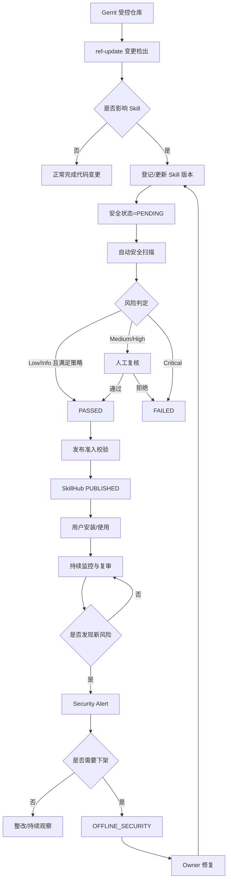
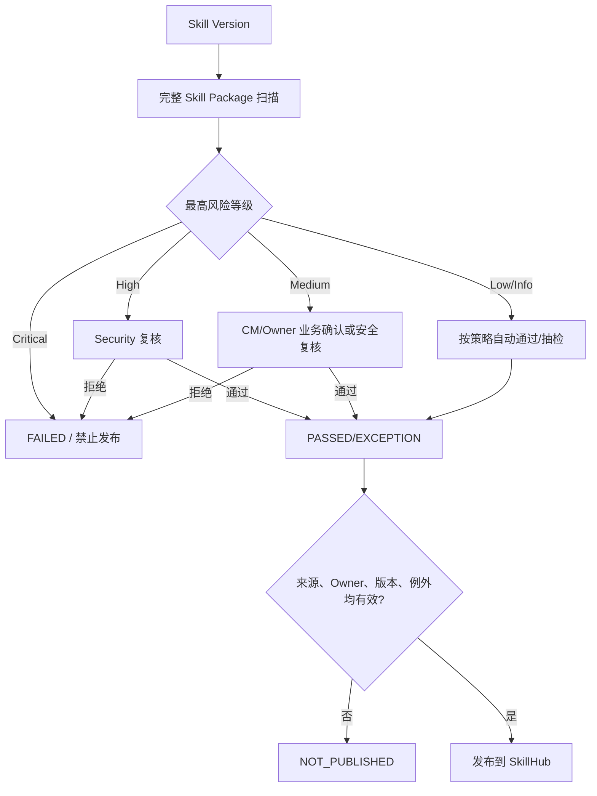
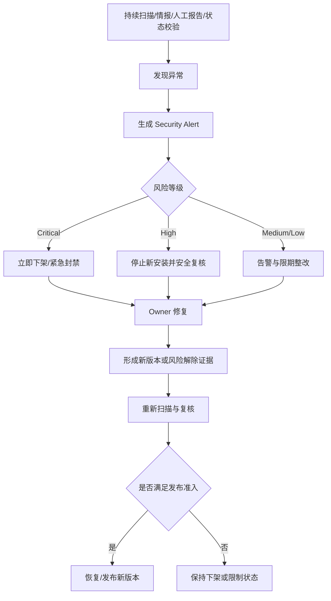

# 企业内部 Skill 安全管理策略

**文档版本：V1.0**  
**文件属性：内部管理文件**  
**适用对象：公司内部 Agent Skill / AI Skill 的开发、维护、审核、发布、使用与安全运营活动**

---

## 1. 总则

### 1.1 目的

为规范公司内部 Skill 的开发、引入、变更、安全审查、发布、使用、监控和退役活动，建立统一的 Skill 可信供应链，降低提示注入、越权执行、敏感信息泄露、恶意依赖、外部数据传输、供应链污染及审核后版本漂移等风险，制定本策略。

本策略的核心目标是确保公司正式使用的 Skill 满足以下要求：

- **来源可追溯**：能够定位到 Gerrit Repository、Branch、Skill Path 和 Commit；
- **资产可识别**：能够准确识别 Skill 及其完整管理边界；
- **版本可管理**：Skill 每次有效变化均形成独立版本记录；
- **风险可判断**：发布前完成自动安全扫描和必要的人工复核；
- **发布可控制**：仅审核通过的明确版本可进入企业 SkillHub；
- **使用可约束**：企业正式推荐或允许使用的 Skill 以 SkillHub 发布版本为准；
- **异常可处置**：已发布 Skill 出现新风险时能够告警、限制、下架和恢复；
- **过程可审计**：从发现、审核、发布到下架的全过程均保留审计证据。

### 1.2 基本原则

1. **源代码仓库不等于可信内容。** Skill 进入 Gerrit 仅代表来源可追溯，不代表内容已通过公司安全认可。
2. **安全结论绑定具体版本。** Skill 的安全审查结论仅对被审查的具体版本有效，新版本不得直接继承旧版本的安全结论。
3. **SkillHub 作为可信分发入口。** 只有完成安全审查并满足发布准入条件的 Skill 版本方可发布到 SkillHub。
4. **最小权限。** Skill、扫描服务、发布服务及相关账号均应遵循最小权限原则。
5. **自动化优先、人工兜底。** 可自动识别和判断的风险由工具处理；高风险、业务例外和复杂场景由人工复核。
6. **发布前控制与发布后监控并重。** 安全管理不仅覆盖上架前检查，也覆盖发布后的持续复审、异常告警和下架恢复。

---

## 2. 适用范围与信任边界

### 2.1 纳管范围

本策略适用于以下 Skill：

- 存储于公司 Gerrit 受控代码仓库中的 Skill；
- 以 `SKILL.md` 为识别锚点的 Skill 目录；
- 计划在公司内部共享、复用、安装或发布到企业 SkillHub 的 Skill；
- 已在企业 SkillHub 发布并处于可使用状态的 Skill；
- Skill Root 下与 Skill 能力有关的脚本、配置、引用、资源、依赖声明及其他受 Git 管理的文件。

### 2.2 非正式 Skill

未进入公司治理流程的本地临时 Skill、公网下载 Skill、个人自行复制的 Skill，不得被视为公司正式可信 Skill，也不得以公司官方名义向他人分发。

### 2.3 信任层级

| 层级 | 状态含义 | 是否可作为公司正式可信 Skill |
|---|---|---|
| Gerrit Source | 已进入公司代码管理体系，来源可追溯 | 否 |
| Security Approved | 指定版本已完成安全扫描与审核 | 是，具备发布资格 |
| SkillHub Published | 审核通过的指定版本已发布到企业 SkillHub | 是，作为正式分发版本 |

**控制原则：Gerrit 管来源，安全审查管可信，SkillHub 管分发。**

---

## 3. 术语与资产模型

### 3.1 Skill

Skill 是面向 Agent、Coding Assistant 或其他 AI Runtime 的能力组件，可由指令、脚本、配置、依赖、引用资料和资源文件组成。

### 3.2 Skill Root

以 `SKILL.md` 所在目录作为 Skill Root。Skill Root 是 Skill 资产识别和变更影响判断的基本目录边界。

### 3.3 Skill Package

Skill Root 下纳入 Git 管理的全部相关内容构成 Skill Package。除非公司策略明确排除，否则 `SKILL.md`、scripts、references、assets、README、配置文件及其他 tracked files 均属于 Skill Package 的管理范围。

### 3.4 Skill 身份

一个 Skill 实例由以下信息联合标识：

```text
Repository + Branch + Skill Path + Skill Name
```

其中 Skill Name 优先使用 `SKILL.md` 中定义的名称；无有效名称时可使用目录名作为识别名称，并标记数据质量异常。

### 3.5 Skill Version

Skill Version 以对应 Gerrit/Git Commit ID 作为来源版本标识。每次 Skill 有效内容变化均形成新的版本记录。

---

## 4. 角色与职责

| 角色 | 主要职责 |
|---|---|
| Skill Owner | 开发、维护和修复 Skill；说明业务用途、必要权限、网络访问和依赖需求；配合风险整改 |
| CM | 负责 Skill 资产台账、治理流程、状态维护、审核协调、发布与下架管理、审计追踪 |
| Security | 负责安全规则、High/Critical 风险复核、安全例外审批、紧急安全事件处置 |
| SkillHub Admin | 负责 SkillHub 权限、发布、下架、平台配置和运行保障 |
| 普通用户 | 仅使用公司批准的正式 Skill；发现异常行为时及时反馈 |

CM 是 Skill 安全治理流程的管理责任方，但不替代 Security 对高风险技术问题的专业判断。

---

## 5. Skill 检出与资产登记

### 5.1 历史资产盘点

公司应定期或按管理要求对纳管 Gerrit 仓库执行 Skill 资产盘点，查找 `SKILL.md` 并建立或校正 Skill 资产台账。盘点结果至少应包含：

- Repository；
- Branch；
- Skill Name；
- Skill Path；
- 当前 Commit；
- Skill Owner；
- 安全审查状态；
- SkillHub 发布状态。

### 5.2 日常增量检出

Gerrit 使用 `ref-update` 作为日常 Skill 变更检出入口。当受控分支发生更新时，应识别该次 Ref Update 对 Skill 的影响。

检出规则至少包括：

- 新增 `SKILL.md`：识别为新增 Skill；
- 已知 Skill Root 内任一受管文件修改：识别为 Skill 更新；
- `SKILL.md` 或整个 Skill Root 删除：识别为 Skill 删除；
- Skill Root 移动或重命名：记录原路径与新路径，并保持历史追溯关系；
- 同一次 Ref Update 涉及多个 Commit 时，应以 Ref 更新前后的完整差异作为变化判断依据，不得仅检查最后一个 Commit。

### 5.3 资产登记

检出新增 Skill 时，应创建当前资产记录和初始版本记录；检出已有 Skill 变化时，应追加历史版本，并更新当前版本信息。

任何新增或更新后的 Skill，其最新版本安全状态必须自动进入**待审**状态。

---

## 6. Skill 变更与版本管理

### 6.1 安全状态失效

已审核 Skill 的 Skill Package 内容发生变化后，原安全结论不得自动沿用。最新版本应立即重新进入安全审查流程。

```text
已通过版本 V1
      ↓
Skill 内容发生变化
      ↓
生成 V2
      ↓
V2 = 待审
```

### 6.2 已发布旧版本处理

新版本进入待审状态时，不应自动否定上一已批准版本。若上一版本不存在已知安全风险，可继续作为 SkillHub 当前正式版本，直至新版本审核通过并完成替换。

### 6.3 删除与退役

Skill 在 Gerrit 中被删除或明确停止维护时，应记录退役事实，并评估 SkillHub 对应版本是否继续保留。源码正常退役与安全事件下架应使用不同的生命周期状态和下架原因。

---

## 7. Skill 安全审查

### 7.1 审查对象

安全审查应针对具体 Skill Version 的完整 Skill Package，不得仅审查 `SKILL.md` 单文件。

### 7.2 自动扫描范围

自动安全扫描至少覆盖以下领域：

| 扫描领域 | 主要风险 | 重点检查内容 |
|---|---|---|
| 指令安全 | 提示注入、越权、隐藏行为 | 覆盖安全限制、诱导越权、隐藏指令、绕过策略 |
| 代码执行 | 任意命令执行、RCE | Shell、PowerShell、`exec/eval`、动态命令拼接、远程脚本执行 |
| 文件访问 | 越界读取、删除、覆盖 | 敏感目录、任意路径、递归删除、写系统目录、跨目录访问 |
| 网络访问 | 数据外传、恶意下载 | 公网地址、未知域名、任意 URL、上传行为、远程下载 |
| 凭据安全 | Token/密码泄漏 | 明文 Secret、私钥、访问令牌、敏感环境变量读取与日志输出 |
| 依赖安全 | 供应链污染、已知漏洞 | pip/npm 等依赖、安装脚本、未知源、CVE、版本未固定 |
| 数据安全 | 敏感信息泄漏 | 源码、配置、用户数据、日志、业务数据的外发或持久化 |
| 特殊文件 | 隐藏载荷、审查盲区 | symlink、submodule、LFS、binary、压缩包、Office/PDF、可执行文件 |

### 7.3 风险等级

| 风险等级 | 定义 | 处置规则 |
|---|---|---|
| Critical | 明确恶意、凭据窃取、严重数据外传、关键系统破坏或可直接导致重大安全事件 | 禁止发布；已发布版本立即进入紧急处置 |
| High | 高概率导致越权、执行、泄漏或供应链安全事件 | 禁止自动发布，必须由 Security 复核 |
| Medium | 存在安全风险但可能属于合理业务能力 | 必须完成业务确认或安全复核后方可发布 |
| Low | 低影响或低概率问题 | 可按策略自动通过或抽检 |
| Info | 信息提示 | 记录，不阻断发布 |

### 7.4 人工复核

以下情况必须进入人工复核：

- 出现 High 或 Critical 风险；
- 出现无法由工具确定业务合理性的 Medium 风险；
- Skill 需要访问敏感系统、敏感数据或高权限凭据；
- Scanner 无法完整分析 Skill Package；
- 存在未识别的二进制、子模块、远程加载或其他审查盲区；
- Owner、CM 或 Security 主动要求人工复核。

---

## 8. 安全审批与例外管理

### 8.1 审批原则

Scanner 结果是安全审批的重要输入，但不单独代表最终批准。Skill 必须同时满足安全规则、业务合理性和发布准入要求。

### 8.2 例外条件

当 Medium 或部分可控 High 风险属于业务必要能力且无法立即消除时，可申请安全例外。例外必须记录：

- Skill 名称及具体版本；
- 风险项及规则编号；
- 业务必要性；
- 申请人和审批人；
- 补偿控制；
- 有效期；
- 到期后的复审要求。

禁止以“永久忽略”替代例外管理。Skill 版本发生变化、补偿控制失效或例外到期后，原例外自动失效。

Critical 风险原则上不得通过普通例外方式发布。

### 8.3 安全状态

安全状态至少应支持：

```text
PENDING      待审
SCANNING     扫描中
PASSED       已通过
FAILED       未通过
EXCEPTION    有效例外
```

---

## 9. SkillHub 发布管理

### 9.1 SkillHub 定位

企业 SkillHub 是公司正式 Skill 的可信发布和分发入口，用于隔离 Gerrit 中的开发版本与公司正式可用版本。

### 9.2 发布准入

Skill Version 满足以下全部条件后方可发布：

- 来源属于纳管 Gerrit Repository；
- Skill 身份、Owner 和版本信息完整；
- 安全扫描已完成；
- 不存在未处置的 Critical/High 风险；
- 需人工复核的事项已完成审批；
- 例外处于有效期内；
- 发布版本与审批版本完全一致。

### 9.3 发布版本一致性

SkillHub 发布对象必须绑定具体 Commit。任何时候均应能够从 SkillHub 发布版本反向追溯到 Gerrit Repository、Branch、Skill Path 和 Commit。

不得将“最新代码”作为隐式发布对象；发布必须明确到具体版本。

### 9.4 版本更新

新版本未通过审查前，SkillHub 可继续提供上一已批准版本。新版本通过后方可替换当前发布版本。

### 9.5 发布信息展示

SkillHub 页面至少应展示：

- Skill Name；
- 功能描述；
- Owner；
- 来源 Repository / Branch / Path；
- 发布 Commit；
- 安全状态与风险等级；
- 最近安全审查时间；
- 最近发布时间；
- 生命周期状态；
- 例外状态（如存在）。

---

## 10. SkillHub 使用管理

### 10.1 使用原则

公司正式推荐、共享和统一分发的 Skill 应以 SkillHub 中处于 **PUBLISHED** 状态的版本为准。

普通用户不得将 Gerrit 中未经批准的开发版本视为公司正式 Skill 使用或向他人分发。

### 10.2 权限要求

- 普通用户仅可搜索、查看和安装已批准 Skill；
- Skill Owner 可查看本人 Skill、扫描结果和整改状态；
- CM 可执行资产维护、审核流程、发布和下架管理；
- Security 可处理高风险、例外和紧急封禁；
- SkillHub Admin 负责平台和权限管理。

### 10.3 安装与升级

- 安装前应向用户展示 Skill 来源、版本和安全状态；
- 下架版本不得继续提供新安装；
- Skill 升级只能升级到新的已批准版本；
- 不得因 Gerrit 出现新 Commit 而自动将用户升级到待审版本。

---

## 11. 持续安全监控与复审

### 11.1 持续监控触发条件

以下事件应触发已发布 Skill 的重新评估或重扫：

- Scanner 规则发生重大更新；
- 新增高危 CVE、恶意 IOC 或供应链风险情报；
- Skill 依赖的外部组件出现重大安全问题；
- SkillHub 发布状态与安全审批记录不一致；
- Skill Source 被删除、替换或不可访问；
- Security、Owner 或用户报告异常行为；
- 定期复审任务到期。

### 11.2 状态一致性检查

公司应持续检查以下三类版本是否一致：

```text
Gerrit 来源版本
Security 审批版本
SkillHub 实际发布版本
```

发现未经审批的版本被发布、发布版本无法追溯或审批记录缺失时，应生成安全告警。

---

## 12. 异常告警管理

### 12.1 告警分类

告警分为：

- **Security Alert**：Skill 内容、版本或治理状态存在安全风险；
- **Operational Alert**：Scanner、数据库、同步服务、SkillHub 等支撑系统运行异常。

两类告警应分别管理，避免一般运维故障稀释安全事件。

### 12.2 Security Alert 触发条件

至少包括：

- 已发布 Skill 新发现 Critical 或 High 风险；
- 未通过安全审查的版本被发布；
- SkillHub 发布版本与审批版本不一致；
- 已发布 Skill 对应 Gerrit Source 被删除、替换或不可访问；
- 发现明文凭据、数据外传、恶意下载、远程执行等明确高风险行为；
- 例外已过期但 Skill 仍处于 Published 状态。

### 12.3 告警通知

Security Alert 应通知 Skill Owner、CM 和 Security；涉及平台处置时同步通知 SkillHub Admin。Critical 事件应采用高优先级渠道并立即处置。

---

## 13. Skill 下架与恢复

### 13.1 下架类型

Skill 下架状态至少区分：

```text
OFFLINE_SECURITY      因安全风险下架
OFFLINE_DEPRECATED    因正常退役下架
OFFLINE_MANUAL        因管理或业务原因人工下架
```

### 13.2 安全下架规则

| 场景 | 处置 |
|---|---|
| Critical、明确恶意、凭据窃取、严重数据外传 | 立即下架或紧急封禁 |
| High | 停止新安装并进入安全复核；根据影响决定是否立即下架 |
| Medium | 告警、限期整改，根据业务影响决定是否限制使用 |
| Low / Info | 记录或抽检，一般不触发下架 |

### 13.3 下架影响控制

安全下架后至少应执行：

- SkillHub 停止新安装；
- 页面标识下架状态及原因；
- 通知 Owner、CM、Security 及受影响用户；
- 对已安装实例给出停用、替换或升级要求；
- 保留历史版本和下架审计记录，不得删除安全证据。

### 13.4 恢复上架

恢复必须满足：

- 风险已修复或得到明确解除；
- 形成新的可追溯版本或具有充分的风险解除证据；
- 完成重新扫描；
- 完成必要的人工复核；
- 满足正常发布准入条件。

不得仅通过管理员手工修改状态绕过重新审查。

---

## 14. 审计与追溯

### 14.1 审计事件

至少记录以下事件：

- Skill 首次发现和登记；
- Skill 新版本生成；
- 安全状态变化；
- 自动扫描结果；
- 人工复核结论；
- 例外申请、审批和到期；
- SkillHub 发布、升级、下架和恢复；
- 安全告警和处置结果；
- Owner、权限或关键元数据变更。

### 14.2 最低审计字段

审计记录至少包含：

- Skill Name / Skill ID；
- Repository、Branch、Skill Path；
- Commit；
- Owner；
- 操作类型；
- 操作时间；
- 操作人或服务账号；
- Scanner 名称及版本；
- 风险等级及规则编号；
- 审核结论与审核人；
- 发布/下架状态；
- 下架或恢复原因；
- 关联例外信息。

审计记录应满足不可随意篡改、可查询和可关联追溯要求。

---

## 15. 凭据、账号与平台安全

### 15.1 凭据管理

Gerrit Hook、Scanner、数据库、Jira、SkillHub API 等使用的账号密码、Token 和证书不得硬编码在共享代码仓库中。

应使用受控配置、环境变量或公司 Secret 管理能力，并限制文件访问权限。

### 15.2 服务账号

服务账号必须遵循最小权限原则：

- 数据库账号只授予业务所需的读写权限；
- 发布账号只允许操作规定范围的 Skill；
- Scanner 使用的 Git 账号只授予必要读取权限；
- 不得使用 root、管理员或个人高权限账号作为长期运行凭据。

### 15.3 网络安全

Scanner、发布服务和 SkillHub 应限制不必要的公网访问。对确需访问公网的扫描、依赖解析或外部 API，应建立域名、代理或网络出口控制。

---

## 16. 状态管理

### 16.1 Security Status

```text
PENDING    待审
SCANNING   扫描中
PASSED     已通过
FAILED     未通过
EXCEPTION  有效例外
```

### 16.2 Publication Status

```text
NOT_PUBLISHED  未发布
PUBLISHED      已发布
OFFLINE        已下架
DEPRECATED     已退役
```

### 16.3 正式可用条件

仅当满足以下条件时，Skill 才属于公司正式可用状态：

```text
Security Status = PASSED 或有效 EXCEPTION
AND
Publication Status = PUBLISHED
AND
SkillHub 发布版本 = Security 审批版本
```

---

## 17. 关键控制规则

1. 公司正式 Skill 必须具有可追溯的 Gerrit 来源。
2. `SKILL.md` 所在目录作为 Skill Root，安全审查覆盖完整 Skill Package。
3. Skill Root 内受管内容发生变化时，最新版本安全状态必须失效并重新进入待审。
4. 安全审查结论必须绑定具体 Commit，不得绑定“最新版本”等动态引用。
5. 未完成安全审查的版本不得发布到企业 SkillHub。
6. 新版本待审期间，上一无已知风险的批准版本可继续提供服务。
7. Critical 风险版本不得发布；已发布后新发现 Critical 风险时必须立即进入紧急处置。
8. High 风险不得自动发布，必须完成 Security 复核。
9. 安全例外必须记录原因、审批人、补偿控制和有效期。
10. SkillHub 中的每个正式版本必须能够反向追溯到 Gerrit Commit。
11. 下架、恢复、例外和人工审批必须保留完整审计记录。
12. Skill 相关服务账号和凭据不得硬编码于代码仓库，必须遵循最小权限原则。

---

## 18. 流程图

### 18.1 Skill 全生命周期安全管理流程



### 18.2 安全审查与发布准入流程



### 18.3 异常告警、下架与恢复流程



---

## 19. 附则

1. 本策略适用于公司内部正式 Skill 的安全管理活动。
2. 各系统可依据本策略实现具体自动化流程，但不得降低本策略规定的发布准入、安全审查和审计要求。
3. 当公司安全规范、监管要求或 AI 技术形态发生变化时，应同步调整具体检测规则和执行细则。
4. 本策略未明确规定的高风险场景，由 CM 联合 Security 按最小风险原则处置。

---

> **治理原则：来源可追溯、版本可识别、风险可判断、发布可控制、异常可下架、全过程可审计。**
