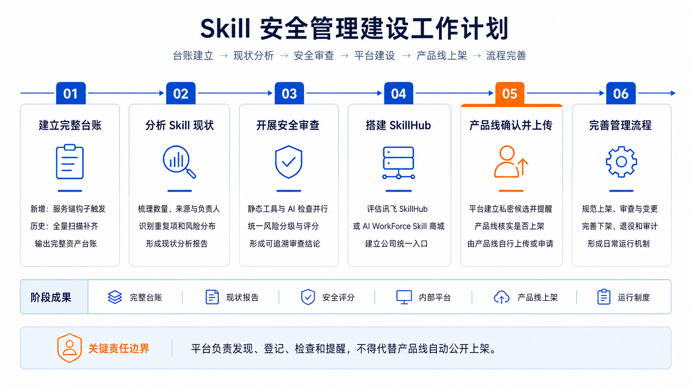

# Skill 安全管理建设规划

> 文档版本：V1.0
>
> 文档状态：当前建设规划
>
> 基线日期：2026-08-27

本文件只说明 Skill 安全管理能力的建设顺序、主要工作和完成标准。正式管理规则见 `docs/11-final-skill-security-management-framework.md`。

## 1. 建设目标

按照“先摸清资产、再开展检查、然后建设统一平台、最后完善管理流程”的顺序，逐步形成公司内部 Skill 的完整管理能力。

建设过程中坚持：

- 先把公司代码库中的 Skill 找全，再开展大范围治理；
- 新增 Skill 和历史 Skill 使用不同的发现方式；
- 安全检查同时使用常规静态工具和 AI 检查；
- 产品线是 Skill 的责任主体；
- 产品线自行确认并上传 Skill；
- 平台可以建立私密候选和发送提醒，但不得自动公开上架；
- 每一步先形成可使用的结果，再进入下一步。

## 2. 总体建设顺序



```text
1. 建立完整台账
→ 2. 分析公司 Skill 现状
→ 3. 建设安全检查和评分
→ 4. 搭建公司 SkillHub
→ 5. 推动产品线确认并上传
→ 6. 完善上架、审查和退役流程
```

## 3. 第一项：建立完整 Skill 台账

### 3.1 目标

完整掌握公司 Gerrit 代码库中现有 Skill，并能够持续发现新增和变化的 Skill。

### 3.2 主要工作

#### 新增和变化 Skill

- 使用 Gerrit 服务端 Hook 触发；
- 识别新增、修改、删除、移动和重命名；
- `SKILL.md` 未变化，但 Skill 目录内脚本、配置或资料变化时也要更新台账；
- 一次提交涉及多个 Skill 时分别登记；
- 记录最新代码版本并保留历史版本。

#### 历史 Skill

- 对纳管 Gerrit 仓库执行全量扫描；
- 查找所有 `SKILL.md`；
- 获取 Skill 所在目录和基础信息；
- 补充当前代码版本；
- 建立历史 Skill 初始台账；
- 支持重复扫描和结果核对，避免重复记录。

#### 台账字段

至少收集：

- Skill 名称和说明；
- 所属产品线和负责人；
- 仓库、分支、路径；
- 当前 Commit ID；
- 首次发现时间、最近变化时间；
- 当前状态；
- 是否已经进入 SkillHub；
- 是否完成安全检查。

负责人无法自动确认时，应标记为“待产品线确认”，不能自行猜测。

### 3.3 交付成果

- 新增 Skill 自动登记能力；
- 历史 Skill 全量扫描能力；
- 统一 Skill 台账；
- Skill 版本历史；
- 台账查询和导出结果；
- 代码库与台账的核对机制。

### 3.4 完成标准

- 纳管仓库已经全部扫描；
- 新增和变化 Skill 能够稳定进入台账；
- 删除、移动和重命名能够正确记录；
- 台账可以追查到仓库、分支、路径和 Commit；
- 重复触发不会产生重复数据；
- 抽样核对代码库与台账结果一致。

## 4. 第二项：理清数据并分析公司 Skill 现状

### 4.1 目标

在完整台账基础上，了解公司 Skill 的数量、分布、用途、维护情况和主要问题，为后续检查和 SkillHub 建设提供依据。

### 4.2 主要工作

- 统计 Skill 总量和产品线分布；
- 统计仓库、分支和目录分布；
- 识别无人维护、负责人不清楚的 Skill；
- 识别名称重复、内容相似或多处复制的 Skill；
- 识别缺少说明、结构不完整或长期未更新的 Skill；
- 统计脚本语言、外部依赖、网络访问和工具调用情况；
- 识别已经在使用但未进入统一平台管理的 Skill；
- 与产品线核实 Skill 是否仍在使用、是否准备上架、是否应退役。

### 4.3 交付成果

- 公司 Skill 现状分析报告；
- 各产品线 Skill 清单；
- 待确认负责人清单；
- 重复或相似 Skill 清单；
- 建议保留、整改和退役清单；
- Skill 类型、语言、依赖和风险特征统计；
- 后续安全检查批次建议。

### 4.4 完成标准

- 每个 Skill 都有明确分类；
- 大部分 Skill 已确认产品线和负责人；
- 无人维护、重复和长期未更新 Skill 已形成待办；
- 能够按产品线、用途和风险特征形成统计结果；
- 产品线可以查看并确认与自己相关的台账数据。

## 5. 第三项：建设安全检查和统一评分

### 5.1 目标

通过常规静态工具和 AI 检查并行运行，对完整 Skill 内容形成统一、可解释的风险结果和评分。

### 5.2 工具方向

#### 常规静态检查

可评估和接入：

- Cisco AI Skill Scanner；
- NVIDIA 相关开源安全检查工具；
- 公司已有的代码、依赖和敏感信息检查工具；
- 其他适合 Skill 文件和脚本的开源静态工具。

#### AI 检查

可评估和接入：

- skill-vetter；
- 其他用于检查 Skill 的开源 Skill；
- 公司内部大模型检查能力；
- 针对 Skill 说明与实际行为一致性的 AI 检查。

具体工具以实际验证效果、部署条件、维护情况和公司使用要求为准，不在本规划中提前锁定唯一工具。

### 5.3 运行方式

```text
完整 Skill 内容
├─ 常规静态工具检查
├─ AI 检查
└─ 公司已有安全工具检查
        ↓
统一整理检查结果
        ↓
形成风险等级、评分和整改建议
```

各工具并行执行，单个工具的“通过”不能直接代表 Skill 整体通过。工具失败或无法识别的内容应单独标记，不能按低风险处理。

### 5.4 检查内容

- 指令是否诱导越权或绕过规则；
- 脚本和命令是否危险；
- 文件读写是否超出合理范围；
- 是否访问未知网络地址；
- 是否包含或读取账号密码；
- 工具和 MCP 调用是否合理；
- 依赖来源和版本是否安全；
- 是否可能泄露公司或用户数据；
- Skill 说明与实际行为是否一致；
- 是否存在无法检查的特殊文件。

### 5.5 统一评分

评分结果至少包含：

- 总体风险等级：严重、高、中、低、提示；
- 各检查类别结果；
- 发现问题数量；
- 问题所在文件和说明；
- 整改建议；
- 未检查或无法判断的内容；
- 使用的工具和检查时间；
- 是否需要人工审查。

评分应重点帮助产品线理解和整改，不应只给出一个无法解释的总分。只要存在尚未处理的严重风险，不论总分多高都不能上架。

### 5.6 交付成果

- 可并行调用多种工具的检查流程；
- 统一检查结果格式；
- Skill 风险报告和评分；
- 产品线整改清单；
- 人工审查待办；
- 检查结果查询和导出能力。

### 5.7 完成标准

- 能够对完整 Skill 目录进行检查；
- 静态工具和 AI 检查可以并行执行；
- 各工具结果能够统一展示；
- 严重和高风险不会被自动放行；
- 工具失败和检查不完整能够清楚展示；
- 使用真实 Skill 样本完成准确性和误报验证；
- 产品线能够根据报告完成整改。

## 6. 第四项：搭建 SkillHub

### 6.1 目标

建设公司内部统一的 Skill 展示、上架、查找、安装、升级和退役平台。

### 6.2 平台方向

重点评估：

- 讯飞开源 SkillHub；
- 公司自研 AI WorkForce 平台中的 Skill 商城。

选择时重点比较：

- 是否支持公司账号和权限；
- 是否支持私密候选 Skill；
- 是否支持产品线自行确认和上传；
- 是否支持版本和来源信息；
- 是否能够展示检查结果；
- 是否支持上架审批、下架和退役；
- 是否支持接口对接和操作记录；
- 部署、维护和二次开发成本。

### 6.3 必须具备的能力

- Skill 搜索、浏览和详情展示；
- 产品线和负责人信息；
- 版本和来源信息；
- 私密候选状态；
- 产品线确认和上传入口；
- 上架申请和审核；
- 已上架版本安装和升级；
- 权限控制；
- 下架和退役；
- 操作记录和通知。

### 6.4 交付成果

- 公司内部 SkillHub 环境；
- 公司账号和角色权限；
- 私密候选、上架、下架和退役能力；
- 与台账和检查结果的关联；
- 平台使用说明。

### 6.5 完成标准

- 产品线可以登录并管理自己的 Skill；
- 普通用户只能看到允许公开的 Skill；
- 私密候选不会被普通用户搜索和安装；
- 上架版本可以追查到代码来源和检查记录；
- 未完成必要检查的版本不能公开上架；
- 平台可以完成下架和退役操作。

## 7. 第五项：推动产品线确认并上传现有 Skill

### 7.1 目标

将公司代码库中仍在使用、适合共享的 Skill，逐步转入公司 SkillHub 统一管理。

### 7.2 责任边界

必须明确：

> 产品线负责确认、补充信息并自行上传 Skill；CM 和平台负责提供台账、提醒、检查结果、流程和协助，不得代替产品线自动公开上架。

平台可以：

- 根据台账为产品线建立私密候选记录；
- 将候选 Skill 关联到对应产品线；
- 提醒产品线确认是否需要上架；
- 展示已有检查结果和待整改问题；
- 提供上传或上架申请入口。

平台不可以：

- 未经产品线确认直接公开 Skill；
- 代替产品线填写用途和权限说明；
- 将代码库最新版本自动替换为 SkillHub 正式版本；
- 因为台账中存在 Skill 就默认允许员工安装。

### 7.3 产品线操作

产品线需要：

1. 确认 Skill 是否属于本产品线；
2. 指定负责人；
3. 确认是否仍在使用；
4. 补充功能、使用范围、权限、数据和网络说明；
5. 处理检查发现的问题；
6. 选择需要上架的明确版本；
7. 自行上传或提交上架申请；
8. 后续持续维护和处理风险。

### 7.4 推进方式

- 按产品线分批推进；
- 优先处理使用范围广、风险较高或长期无人维护的 Skill；
- 为每批 Skill 建立确认清单；
- 定期反馈未确认、待整改和待上架情况；
- 对不再使用的 Skill 直接进入退役确认，不要求全部上架。

### 7.5 交付成果

- 产品线确认结果；
- 已确认负责人清单；
- 已上传 Skill 清单；
- 待整改、暂不上架和退役清单；
- 各产品线推进情况。

### 7.6 完成标准

- 台账中的 Skill 已由对应产品线完成确认；
- 准备共享的 Skill 由产品线自行上传；
- 未确认 Skill 保持私密，不会自动公开；
- 不再使用的 Skill 已明确退役处理；
- 已上架 Skill 均有负责人、来源、版本和检查记录。

## 8. 第六项：完善上架、审查和退役流程

### 8.1 目标

将前面建设的台账、检查、SkillHub 和产品线责任整合成稳定、可持续执行的公司流程。

### 8.2 需要完善的流程

#### 上架流程

```text
产品线确认
→ 完善 Skill 信息
→ 选择明确版本
→ 完成安全检查
→ 必要的人工审查
→ 产品线提交上架
→ 上架前核对
→ 正式发布
```

#### 变更流程

```text
代码库出现新版本
→ 台账更新
→ 新版本重新检查
→ 产品线确认是否升级
→ 通过后更新 SkillHub
```

#### 退役流程

```text
产品线提出退役或平台发现长期无人维护
→ 确认影响范围
→ 停止新安装
→ 通知使用者
→ 正式下架或退役
→ 保留历史记录
```

#### 风险处置流程

```text
发现新风险
→ 通知产品线、CM、Security
→ 判断是否限制或下架
→ 产品线修复
→ 重新检查和审查
→ 重新上架或保持下架
```

### 8.3 配套内容

- 产品线责任说明；
- CM、Security 和 SkillHub 管理员职责；
- Skill 信息填写模板；
- 检查和人工审查规则；
- 上架前核对清单；
- 风险通知和处理要求；
- 下架、退役和恢复要求；
- 有条件通过的申请和到期管理；
- 操作记录和定期统计。

### 8.4 交付成果

- 正式上架流程；
- Skill 变更和升级流程；
- 安全审查流程；
- 风险告警和下架流程；
- 退役和恢复流程；
- 各角色操作说明；
- 检查表、申请表和通知模板。

### 8.5 完成标准

- 各角色知道自己需要完成的工作；
- 产品线可以独立完成确认、整改和上架申请；
- CM 和 Security 可以完成审查和风险处置；
- SkillHub 管理员可以按流程上架、下架和恢复；
- 重要操作均有记录；
- 新增、变更、上架、下架、退役和恢复流程均可实际执行。

## 9. 各项工作交付关系

| 顺序 | 工作 | 主要输入 | 主要输出 |
|---|---|---|---|
| 1 | 建立台账 | Gerrit 代码仓库 | 完整 Skill 清单和版本记录 |
| 2 | 现状分析 | Skill 台账 | 分布、负责人、重复、整改和退役清单 |
| 3 | 安全检查 | Skill 内容和现状分析 | 风险报告、评分和整改建议 |
| 4 | 搭建 SkillHub | 管理方案和平台选择结果 | 公司内部 SkillHub |
| 5 | 产品线确认上传 | 台账、检查结果、SkillHub | 已确认、已上传、待整改和退役清单 |
| 6 | 完善流程 | 前五项运行结果 | 正式上架、审查、变更和退役流程 |

## 10. 建议持续关注的数据

- 已纳入台账的 Skill 数量；
- 已明确产品线和负责人的比例；
- 数据异常和无负责人 Skill 数量；
- 已完成完整安全检查的比例；
- 存在严重或高风险问题的 Skill 数量；
- 产品线已确认的比例；
- 产品线自行上传的比例；
- 私密候选待处理数量；
- 已上架、整改中、暂不上架和已退役数量；
- 检查失败和平台处理失败数量；
- 严重问题从发现到通知、下架和恢复所需时间。

## 11. 整体完成标志

当以下条件均满足时，说明 Skill 安全管理能力已经形成完整闭环：

- 公司纳管代码库中的 Skill 已形成完整台账；
- 新增和变化 Skill 能够持续进入台账；
- 公司已经掌握 Skill 数量、分布、负责人和主要问题；
- 静态工具和 AI 检查能够并行运行并形成统一结果；
- 公司内部 SkillHub 可以正常使用；
- 产品线能够自行确认并上传 Skill；
- 未确认候选 Skill 保持私密，不会自动公开；
- 上架、变更、审查、下架、退役和恢复流程能够实际执行；
- 已上架 Skill 均能追查来源、版本、检查结果和负责人。

---

> 建设顺序：先建台账、再看现状、再做检查、再建平台、由产品线自行上传，最后把整套流程固化下来。
